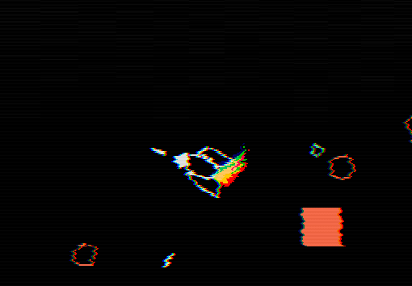
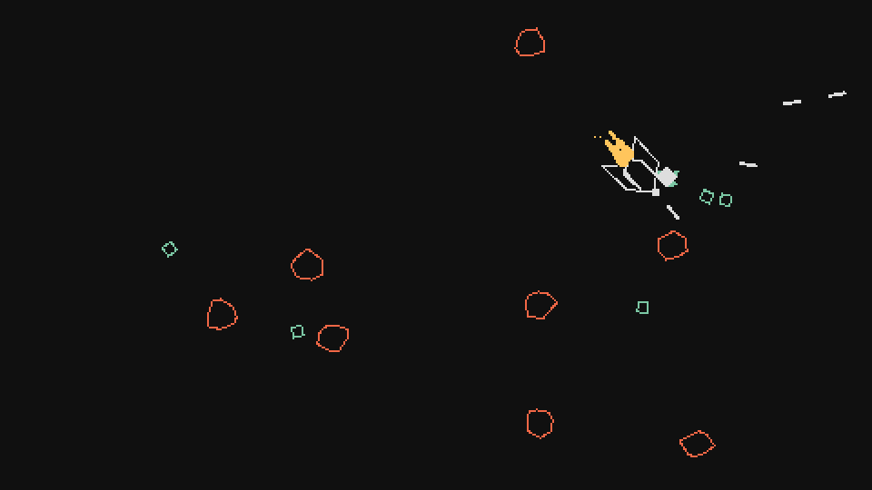
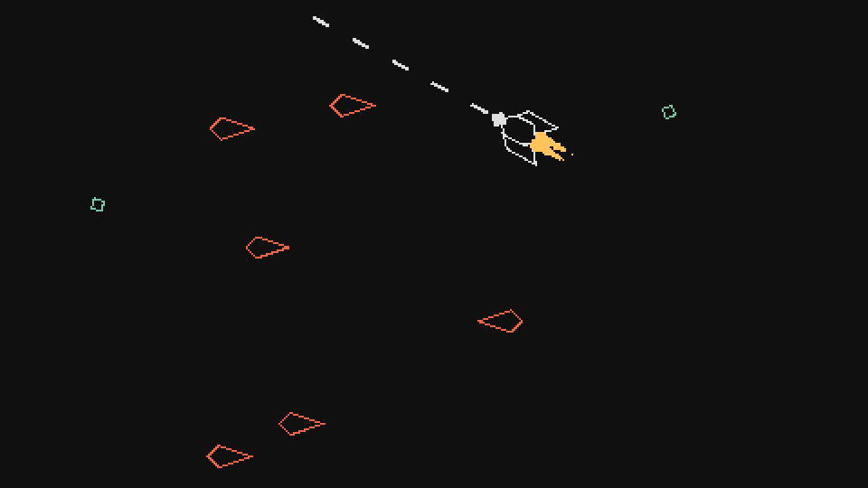
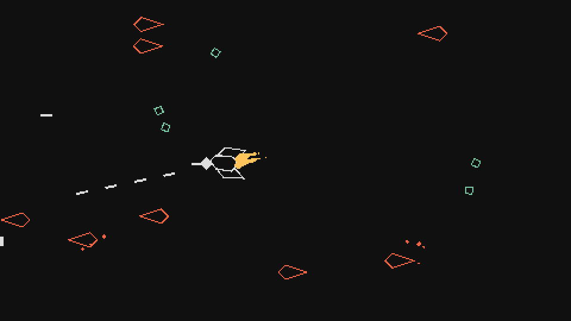
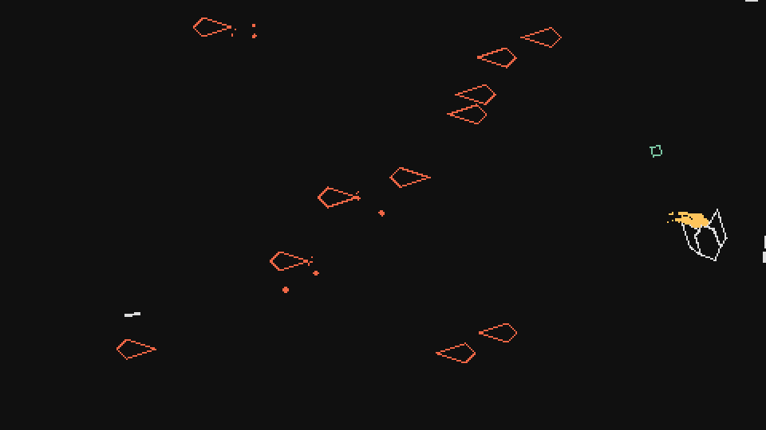

## Introduction

In this article we'll go over the creation of a few enemies as well as the EnemyProjectile class, which is a projectile that some enemies can shoot to hurt the player. This article will be a bit shorter than others since we won't focus on creating all enemies now, only the basic behavior that will be shared among most of them.

## Enemies

Enemies in this game will work in a similar way to how the resources we created in the last article worked, in the sense that they will be spawned at either left or right of the screen at a random y position and then they will slowly move inward. The code used to make that work will be exactly the same as the one used in each resource we implemented.

We'll get started with the first enemy which is called `Rock`. It looks like this:



The constructor code for this object will be very similar to the `Boost` one, but with a few small differences:

```lua
function Rock:new(area, x, y, opts)
    Rock.super.new(self, area, x, y, opts)

    local direction = table.random({-1, 1})
    self.x = gw/2 + direction*(gw/2 + 48)
    self.y = random(16, gh - 16)

    self.w, self.h = 8, 8
    self.collider = self.area.world:newPolygonCollider(createIrregularPolygon(8))
    self.collider:setPosition(self.x, self.y)
    self.collider:setObject(self)
    self.collider:setCollisionClass('Enemy')
    self.collider:setFixedRotation(false)
    self.v = -direction*random(20, 40)
    self.collider:setLinearVelocity(self.v, 0)
    self.collider:applyAngularImpulse(random(-100, 100))
end
```

Here instead of the object using a RectangleCollider, it will use a PolygonCollider. We create the vertices of this polygon with the function `createIrregularPolygon` which will be defined in `utils.lua`. This function should return a list of vertices that make up an irregular polygon. What I mean by an irregular polygon is one that is kinda like a circle but where each vertex might be a bit closer or further away from the center, and where the angles between each vertex may be a little random as well.

To start with the definition of that function we can say that it will receive two arguments: `size` and `point_amount`. The first will refer to the radius of the circle and the second will refer to the number of points that will compose the polygon:

```lua
function createIrregularPolygon(size, point_amount)
    local point_amount = point_amount or 8
end
```

Here we also say that if `point_amount` isn't defined it will default to 8.

The next thing we can do is start defining all the points. This can be done by going from 1 to `point_amount` and in each iteration defining the next vertex based on an angle interval. So, for instance, to define the position of the second point we can say that its angle will be somewhere around `2*angle_interval`, where `angle_interval` is the value `2*math.pi/point_amount`. So in this case it would be around 90 degrees. This probably makes more sense in code, so:

```lua
function createIrregularPolygon(size, point_amount)
    local point_amount = point_amount or 8
    local points = {}
    for i = 1, point_amount do
        local angle_interval = 2*math.pi/point_amount
        local distance = size + random(-size/4, size/4)
        local angle = (i-1)*angle_interval + random(-angle_interval/4, angle_interval/4)
        table.insert(points, distance*math.cos(angle))
        table.insert(points, distance*math.sin(angle))
    end
    return points
end
```

And so here we define `angle_interval` like previously explained, but we also define `distance` as being around the radius of the circle, but with a random offset between `-size/4` and `+size/4`. This means that each vertex won't be exactly on the edge of the circle but somewhere around it. We also randomize the angle interval a bit to create the same effect. Finally, we add both x and y components to a list of points which is then returned. Note that the polygon is created in local space (assuming that the center is 0, 0), which means that we have to then use [`setPosition`](https://love2d.org/wiki/Body:setPosition) to place the object in its proper place.

Another difference in the constructor of this object is the use of the `Enemy` collision class. Like all other collision classes, this one should be defined before it can be used:

```lua
function Stage:new()
    ...
    self.area.world:addCollisionClass('Enemy')
    ...
end
```

In general, new collision classes should be added for object types that will have different collision behaviors between each other. For instance, enemies will physically ignore the player but will not physically ignore projectiles. Because no other object type in the game follows this behavior, it means we need to add a new collision class to do it. If the Projectile collision class only ignored the player instead of also ignoring other projectiles, then enemies would be able to have their collision class be Projectile as well.

The last thing about the Rock object is how its drawn. Since it's just a polygon we can simply draw its points using [`love.graphics.polygon`](https://love2d.org/wiki/love.graphics.polygon):

```lua
function Rock:draw()
    love.graphics.setColor(hp_color)
    local points = {self.collider:getWorldPoints(self.collider.shapes.main:getPoints())}
    love.graphics.polygon('line', points)
    love.graphics.setColor(default_color)
end
```

We get its points first by using [`PolygonShape:getPoints`](https://love2d.org/wiki/PolygonShape:getPoints). These points are returned in local coordinates, but we want global ones, so we have to use [`Body:getWorldPoints`](https://love2d.org/wiki/Body:getWorldPoints) to convert from local to global coordinates. Once that's done we can just draw the polygon and it will behave like expected. Note that because we're getting points from the collider directly and the collider is a polygon that is rotating around, we don't need to use `pushRotate` to rotate the object like we did for the Boost object since the points we're getting are already accounting for the objects rotation.

If you do all this it should look like this:


### Enemies Exercises

**110.** Perform the following tasks:  
- Add an attribute named `hp` to the Rock class that initially is set to 100
- Add a function named `hit` to the Rock class. This function should do the following:
    - It should receives a `damage` argument, and in case it isn't then it should default to 100
    - `damage` will be subtracted from `hp` and if `hp` hits 0 or lower then the Rock object will die
    - If `hp` doesn't hit 0 or lower then an attribute named `hit_flash` will be set to true and then set to false 0.2 seconds later. In the draw function of the Rock object, whenever `hit_flash` is set to true the color of the object will be set to `default_color` instead of `hp_color`.  
**111.** Create a new class named `EnemyDeathEffect`. This effect gets created whenever an enemy dies and it behaves exactly like the `ProjectileDeathEffect` object, except that it is bigger according to the size of the Rock object. This effect should be created whenever the Rock object's `hp` attribute hits 0 or lower.  
**112.** Implement the collision event between an object of the Projectile collision class and an object of the Enemy collision class. In this case, implement it in the Projectile's class update function. Whenever the projectile hits an object of the Enemy class, it should call the enemy's `hit` function with the amount of damage this projectile deals (by default, projectiles will have an attribute named `damage` that is initially set to 100). Whenever a hit happens the projectile should also call its own `die` function.  
**113.** Add a function named `hit` to the Player class. This function should do the following things:  
- It should receive a `damage` argument, and in case it isn't defined it should default to 10
- This function should not do anything whenever the `invincible` attribute is true
- Between 4 and 8 `ExplodeParticle` objects should be spawned
- The `addHP` (or `removeHP` function if you decided to add this one) should take the `damage` attribute and use it to remove HP from the Player. Inside the `addHP` (or `removeHP`) function there should be a way to deal with the case where `hp` hits or goes below 0 and the player dies.

Additionally, the following conditional operations should hold:

- If the damage received is equal to or above 30, then the `invincible` attribute should be set to true and 2 seconds later it should be set to false. On top of that, the camera should shake with intensity 6 for 0.2 seconds, the screen should flash for 3 frames, and the game should be slowed to 0.25 for 0.5 seconds. Finally, an `invisible` attribute should alternate between true and false every 0.04 for the duration that `invincible` is set to true, and additionally the Player's draw function shouldn't draw anything whenever `invisible` is set to true.
- If the damage received is below 30, then the camera should shake with intensity 6 for 0.1 seconds, the screen should flash for 2 frames, and the game should be slowed to 0.75 for 0.25 seconds.

This `hit` function should be called whenever the Player collides with an Enemy. The player should be hit for 30 damage on enemy collision.

___

After finishing these 4 exercises you should have completed everything needed for the interactions between Player, Projectile and Rock enemy to work like they should in the game. These interactions will hold true and be similar for other enemies as well. And it all should look like this:



## EnemyProjectile

So, now we can focus on another part of making enemies which is creating enemies that can shoot projectiles. A few enemies will be able to do that and so we need to create an object, like the Projectile one, but that is used by enemies instead. For this we'll create the `EnemyProjectile` object.

This object can be created at first by just copypasting the code for the `Projectile` one and changing it slightly. Both these objects will share a lot of the same code. We could somehow abstract them out into a general projectile-like object that has the common behavior, but that's really not necessary since these are the only two types of projectiles the game will have. After the copypasting is done the things we have to change are these:

```lua
function EnemyProjectile:new(...)
    ...
    self.collider:setCollisionClass('EnemyProjectile')
end
```

The collision class of an EnemyProjectile should also be EnemyProjectile. We want EnemyProjectiles objects to ignore other EnemyProjectiles, Projectiles and the Player. So we must add the collision class such that it fits that purpose:

```lua
function Stage:new()
    ...
    self.area.world:addCollisionClass('EnemyProjectile', 
    {ignores = {'EnemyProjectile', 'Projectile', 'Enemy'}})
end
```

The other main thing we have to change is the damage. A normal projectile shot by the player deals 100 damage, but a projectile shot by an enemy should deal 10 damage:

```lua
function EnemyProjectile:new(...)
    ...
    self.damage = 10
end
```

Another thing is that we want projectiles shot by enemies to collide with the Player but not with other enemies. So we can take the collision code that the Projectile object used and just turn it around on the Player instead:

```lua
function EnemyProjectile:update(dt)
    ...
    if self.collider:enter('Player') then
        local collision_data = self.collider:getEnterCollisionData('Player')
...
    end
```

Finally, we want this object to look completely red instead of half-red and half-white, so that the player can tell projectiles shot from an enemy to projectiles shot by himself:

```lua
function EnemyProjectile:draw()
    love.graphics.setColor(hp_color)
    ...
    love.graphics.setColor(default_color)
end
```

With all these small changes we have successfully create the EnemyProjectile object. Now we need to create an enemy that will use it!

## Shooter

This is what the Shooter enemy looks like:


As you can see, there's a little effect and then after a projectile is fired. The projectile looks just like the player one, except it's all red.

We can start making this enemy by copypasting the code from the Rock object. This enemy (and all enemies) will share the same property that they code from either left or right of then screen and then move inwards slowly, and since the Rock object already has that code taken care of we can start from there. Once that's done, we have to change a few things:

```lua
function Shooter:new(...)
    ...
    self.w, self.h = 12, 6
    self.collider = self.area.world:newPolygonCollider(
    {self.w, 0, -self.w/2, self.h, -self.w, 0, -self.w/2, -self.h})
end
```

The width, height and vertices of the Shooter enemy are different from the Rock. With the rock we just created an irregular polygon, but here we need the enemy to have a well defined and pointy shape so that the player can instinctively tell where it will come from. The setup here for the vertices is similar to how we did it for designing ships, so if you want you can change the way this enemy looks and make it look cooler.

```lua
function Shooter:new(...)
    ...
    self.collider:setFixedRotation(false)
    self.collider:setAngle(direction == 1 and 0 or math.pi)
    self.collider:setFixedRotation(true)
end
```

The other thing we need to change is that unlike the rock, setting the object's velocity is not enough. We must also set its angle so that physics collider points in the right direction. To do this we first need to disable its fixed rotation (otherwise setting the angle won't work), change the angle, and then set its fixed rotation back to true. The rotation is set to fixed again because we don't want the collider to spin around if something hits it, we want it to remain pointing to the direction it's moving towards.

The line `direction == 1 and math.pi or 0` is basically how you do a ternary operator in Lua. In other languages this would look like `(direction == 1) ? math.pi : 0`. The exercises back in article 2 and 4 I think went over this in detail, but essentially what will happen is that if `direction` is 1 (coming from the right and pointing to the left) then the first conditional will parse to true, which leaves us with `true and math.pi or 0`. Because of precedence between `and` and `or`, `true and math.pi` will go first, which leaves us with `math.pi or 0`, which will return math.pi, since `or` returns the first element whenever both are true. On the other hand, if `direction` is -1, then the first conditional will parse to false and we'll have `false and math.pi or 0`, which will parse to `false or 0`, which will parse to 0, since `or` returns the second element whenever the first is false.

With all this, we can spawn Shooter objects and they should look like this:



Now we need to create the pre-attack effect. Usually in most games whenever an enemy is about to attack something happens that tells the player that enemy is about to attack. Most of the time it's an animation, but it could also be an effect. In our case we'll use a simple "charging up" effect, where a bunch of particles are continually sucked into the point where the projectile will come from until the release happens.

At a high level this is how we'll do it:

```lua
function Player:new(...)
    ...
  
    self.timer:every(random(3, 5), function()
        -- spawn PreAttackEffect object with duration of 1 second
        self.timer:after(1, function()
            -- spawn EnemyProjectile
        end)
    end)
end
```

So this means that with an interval of between 3 and 5 seconds each Shooter enemy will shoot a new projectile. This will happen after the `PreAttackEffect` effect is up for 1 second.

The basic way effects like these that have to do with particles work is that, like with the trails, some type of particle will be spawned every frame or every other frame and that will make the effect work. In this case, we will spawn particles called `TargetParticle`. These particles will move towards a point we define as the target and then die after a duration or when they reach the point.

```lua
function TargetParticle:new(area, x, y, opts)
    TargetParticle.super.new(self, area, x, y, opts)

    self.r = opts.r or random(2, 3)
    self.timer:tween(opts.d or random(0.1, 0.3), self, 
    {r = 0, x = self.target_x, y = self.target_y}, 'out-cubic', function() self.dead = true end)
end

function TargetParticle:draw()
    love.graphics.setColor(self.color)
    draft:rhombus(self.x, self.y, 2*self.r, 2*self.r, 'fill')
    love.graphics.setColor(default_color)
end
```

Here each particle will be tweened towards `target_x, target_y` over a `d` duration (or a random value between 0.1 and 0.3 seconds), and when that position is reached then the particle will die. The particle is also drawn as a rhombus (like one of the effects we made earlier), but it could be drawn as a circle or rectangle since it's small enough and gets smaller over the tween duration.

The way we create these objects in `PreAttackEffect` looks like this:

```lua
function PreAttackEffect:new(...)
    ...
    self.timer:every(0.02, function()
        self.area:addGameObject('TargetParticle', 
        self.x + random(-20, 20), self.y + random(-20, 20), 
        {target_x = self.x, target_y = self.y, color = self.color})
    end)
end
```

So here we spawn one particle every 0.02 seconds (almost every frame) in a random location around its position, and then we set the `target_x, target_y` attributes to the position of the effect itself (which will be at the tip of the ship).

In `Shooter`, we create PreAttackEffect like this:

```lua
function Shooter:new(...)
    ...
    self.timer:every(random(3, 5), function()
        self.area:addGameObject('PreAttackEffect', 
        self.x + 1.4*self.w*math.cos(self.collider:getAngle()), 
        self.y + 1.4*self.w*math.sin(self.collider:getAngle()), 
        {shooter = self, color = hp_color, duration = 1})
        self.timer:after(1, function()
         
        end)
    end)
end
```

The initial position we set should be at the tip of the Shooter object, and so we can use the general math.cos and math.sin pattern we've been using so far to achieve that and account for both possible angles (0 and math.pi). We also pass a `duration` attribute, which controls how long the PreAttackEffect object will stay alive for. Back there we can do this:

```lua
function PreAttackEffect:new(...)
    ...
    self.timer:after(self.duration - self.duration/4, function() self.dead = true end)
end
```

The reason we don't use `duration` by itself here is because this object is what I call in my head a controller object. For instance, it doesn't have anything in its draw function, so we never actually see it in the game. What we see are the `TargetParticle` objects that it commands to spawn. Those objects have a random duration of between 0.1 and 0.3 seconds each, which means if we want the last particles to end right as the projectile is being shot, then this object has to die between 0.1 and 0.3 seconds earlier than its 1 second duration. As a general case thing I decided to make this 0.75 (duration - duration/4), but it could be another number that is closer to 0.9 instead.

In any case, if you run everything now it should look like this:



And this works well enough. But if you pay attention you'll notice that the target position of the particles (the position of the PreAttackEffect object) is staying still instead of following the Shooter. We can fix this in the same way we fixed the ShootEffect object for the player. We already have the `shooter` attribute pointing to the Shooter object that created the PreAttackEffect object, so we can just update PreAttackEffect's position based on the position of this `shooter` parent object:

```lua
function PreAttackEffect:update(dt)
    ...
    if self.shooter and not self.shooter.dead then
        self.x = self.shooter.x + 1.4*self.shooter.w*math.cos(self.shooter.collider:getAngle())
    self.y = self.shooter.y + 1.4*self.shooter.w*math.sin(self.shooter.collider:getAngle())
    end
end
```

And so here every frame we're updating this objects position to be at the tip of the Shooter object that created it. If you run this it would look like this:



One important thing about the update code about is the `not self.shooter.dead` part. One thing that can happen when we reference objects within each other like this is that one object dies while another still holds a reference to it. For instance, the PreAttackEffect object lasts 0.75 seconds, but between its creation and its demise, the Shooter object that created it can be killed by the player, and if that happens problems can occur.

In this case the problem is that we have to access the Shooter's `collider` attribute, which gets destroyed whenever the Shooter object dies. And if that object is destroyed we can't really do anything with it because it doesn't exist anymore, so when we try to `getAngle` it that will crash our game. We could work out a general system that solves this problem but I don't really think that's necessary. For now we should just be careful whenever we reference objects like this to make sure that we don't access objects that might be dead.

Now for the final part, which is the one where we create the EnemyProjectile object. For now we'll handle this relatively simply by just spawning it like we would spawn any other object, but with some specific attributes:

```lua
function Shooter:new(...)
    ...
    self.timer:every(random(3, 5), function()
        ...
        self.timer:after(1, function()
            self.area:addGameObject('EnemyProjectile', 
            self.x + 1.4*self.w*math.cos(self.collider:getAngle()), 
            self.y + 1.4*self.w*math.sin(self.collider:getAngle()), 
            {r = math.atan2(current_room.player.y - self.y, current_room.player.x - self.x), 
             v = random(80, 100), s = 3.5})
        end)
    end)
end
```

Here we create the projectile at the same position that we created the PreAttackEffect, and then we set its velocity to a random value between 80 and 100, and then its size to be slightly larger than the default value. The most important part is that we set its angle (`r` attribute) to point towards the player. In general, whenever you want something to get the angle of something from `source` to `target`, you should do:

```lua
angle = math.atan2(target.y - source.y, target.x - source.x)
```

And that's what we're doing here. After the object is spawned it will point itself towards the player and move there. It should look like this:


If you compare this to the initial gif on this section this looks a bit different. The projectiles there have a period where they slowly turn towards the player rather than coming out directly towards him. This uses the same piece of code as the homing passive that we will add eventually, so I'm gonna leave that for later.

One thing that will happen for the EnemyProjectile object is that eventually it will be filled with lots of functionality so that it can serve the purposes of lots of different enemies. All this functionality, however, will first be implemented in the Projectile object because it will serve as a passive to the player. So, for instance, there's a passive that makes projectiles circle around the player. Once we implement that, we can copypaste that code to the EnemyProjectile object and then implement an enemy that makes use of that idea and has projectiles that circle it instead. A number of enemies will be created in this way so those will be left as an exercise for when we implement passives for the player.

For now, we'll stay with those two enemies (Rock and Shooter) and with the EnemyProjectile object as it is and move on to other things, but we'll come back to create more enemies in the future as we add more functionality to the game.

### EnemyProjectile/Shooter Exercises

**114.** Implement a collision event between Projectile and EnemyProjectile. In the EnemyProjectile class, make it so that whenever it hits an object of the Projectile class, both object's `die` function will be called and they will both be destroyed.  
**115.** Is the way the `direction` attribute is named confusing in the Shooter class? If so, what could it be named instead? If not, how is it not?