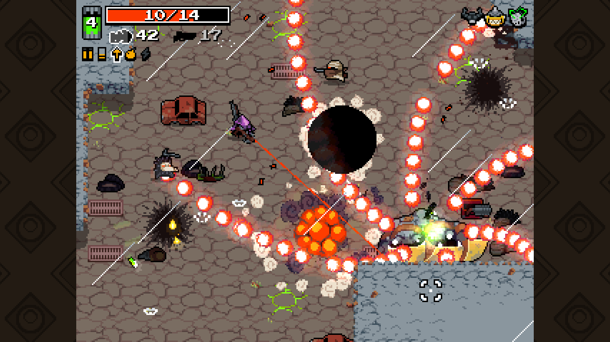
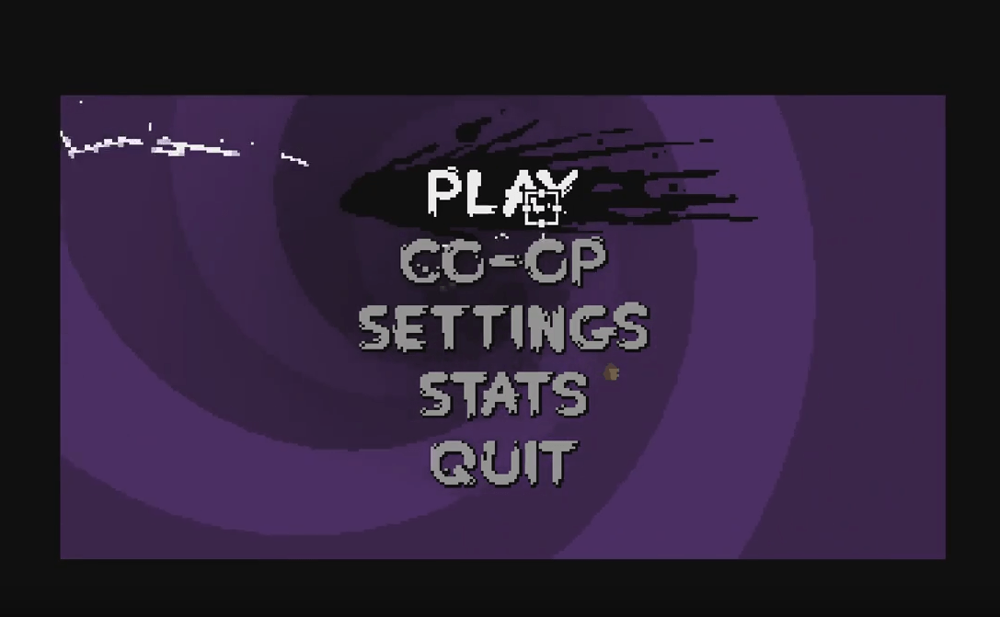
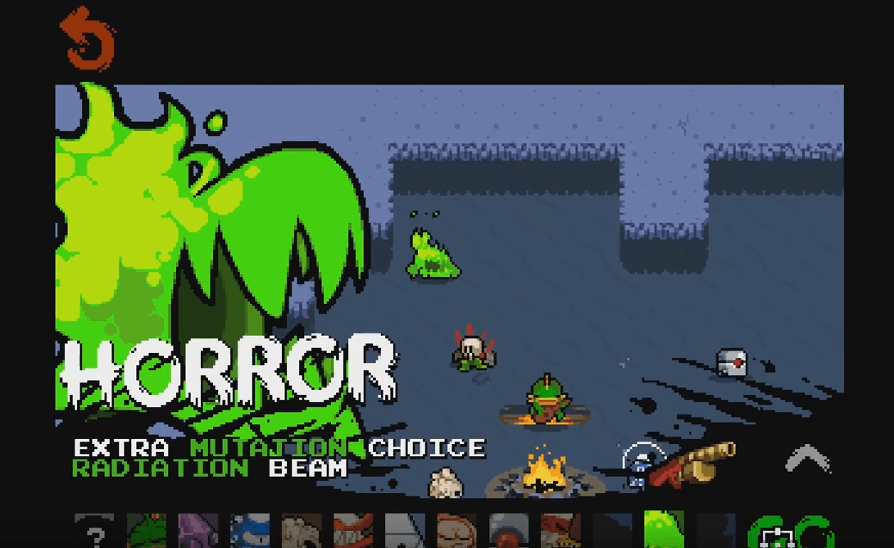
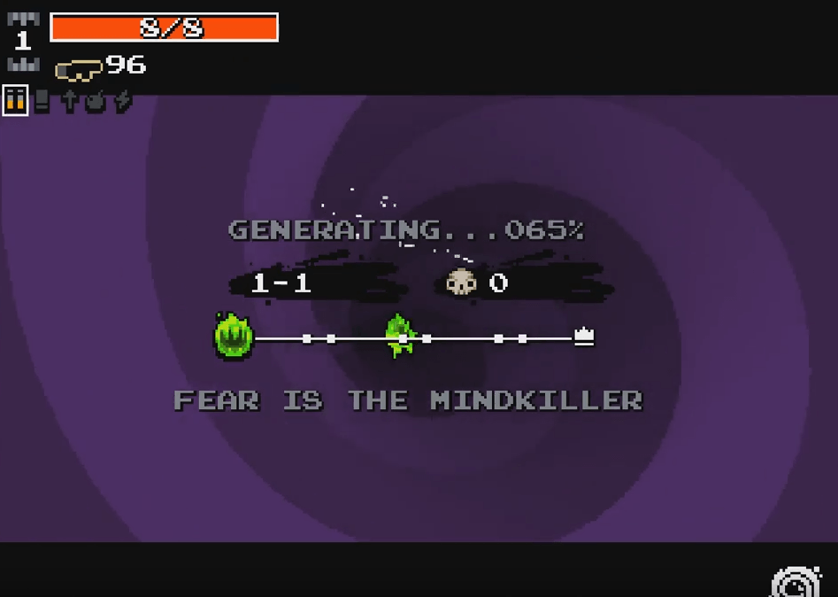
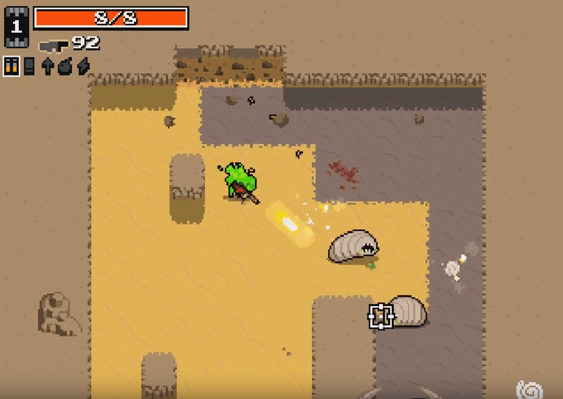
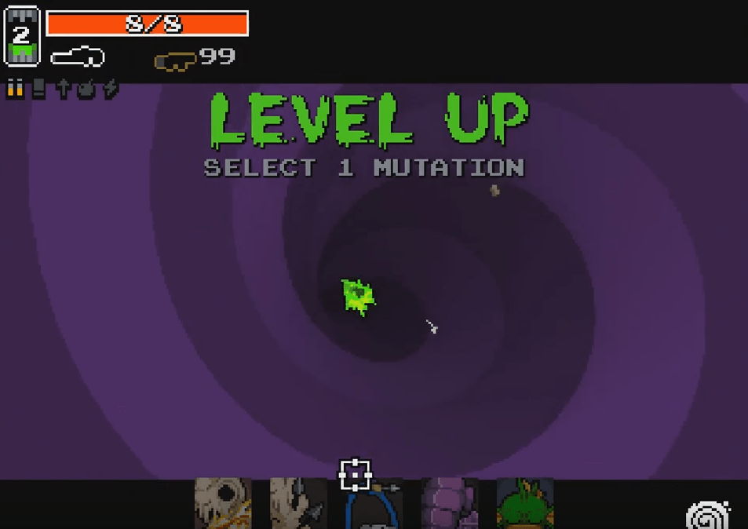
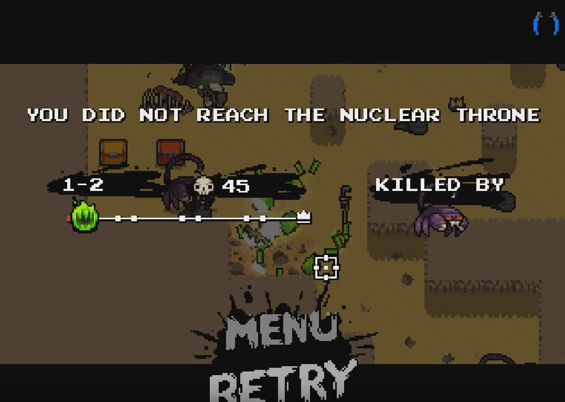
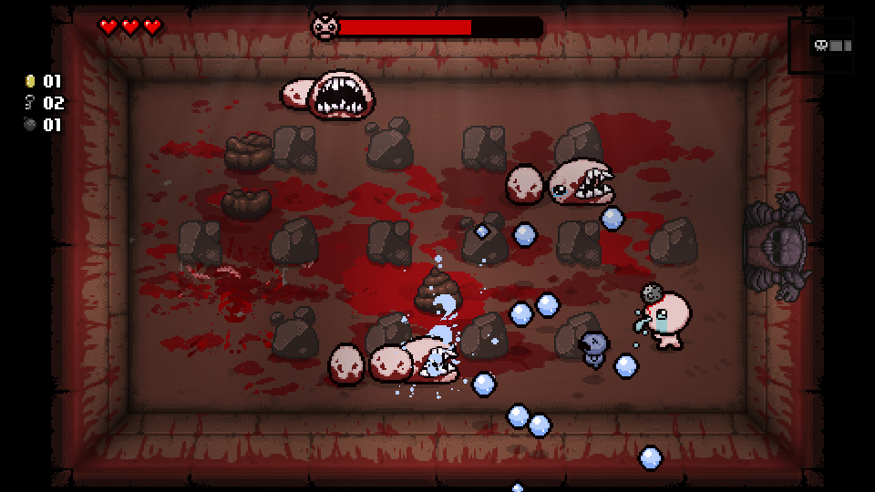

<!-- ---
title: "03 Rooms and Areas"
date: 2018-02-12
author: https://github.com/a327ex
source: https://github.com/a327ex/blog/issues/17
--- -->

# Rooms and Areas

## Introduction

In this article we'll cover some structural code needed before moving on to the actual game. We'll explore the idea of `Rooms`, which are equivalent to what's called a scene in other engines. And then we'll explore the idea of an `Area`, which is an object management type of construct that can go inside a Room. Like the two previous tutorials, this one will still have no code specific to the game and will focus on higher level architectural decisions.

## Room

I took the idea of Rooms from [GameMaker's documentation](https://docs.yoyogames.com/source/dadiospice/002_reference/rooms/index.html). One thing I like to do when figuring out how to approach a game architecture problem is to see how other people have solved it, and in this case, even though I've never used GameMaker, their idea of a Room and the functions around it gave me some really good ideas.

As the description there says, Rooms are where everything happens in a game. They're the places where all game objects will be created, updated and drawn and you can change from one Room to the other. Those rooms are also normal objects that I'll place inside a `rooms` folder. This is what one room called `Stage` would look like:

```lua
Stage = Object:extend()

function Stage:new()

end

function Stage:update(dt)

end

function Stage:draw()

end
```

## Simple Rooms

At its simplest form this system only needs one additional variable and one additional function to work:

```lua
function love.load()
    current_room = nil
end

function love.update(dt)
    if current_room then current_room:update(dt) end
end

function love.draw()
    if current_room then current_room:draw() end
end

function gotoRoom(room_type, ...)
    current_room = _G[room_type](...)
end
```

At first in `love.load` a global `current_room` variable is defined. The idea is that at all times only one room can be currently active and so that variable will hold a reference to the current active room object. Then in `love.update` and `love.draw`, if there is any room currently active it will be updated and drawn. This means that all rooms must have an update and a draw function defined.

The `gotoRoom` function can be used to change between rooms. It receives a `room_type`, which is just a string with the name of the class of the room we want to change to. So, for instance, if there's a `Stage` class defined as a room, it means the `'Stage'` string can be passed in. This works based on how the automatic loading of classes was set up in the previous tutorial, which loads all classes as global variables.

In Lua, global variables are held in a global environment table called `_G`, so this means that they can be accessed like any other variable in a normal table. If the `Stage` global variable contains the definition of the Stage class, it can be accessed by just saying `Stage` anywhere on the program, or also by saying `_G['Stage']` or `_G.Stage`. Because we want to be able to load any arbitrary room, it makes sense to receive the `room_type` string and then access the class definition via the global table.

So in the end, if `room_type` is the string `'Stage'`, the line inside the `gotoRoom` function parses to `current_room = Stage(...)`, which means that a new `Stage` room is being instantiated. This also means that any time a change to a new room happens, that new room is created from zero and the previous room is deleted. The way this works in Lua is that whenever a table is not being referred to anymore by any variables, the garbage collector will eventually collect it. And so when the instance of the previous room stops being referred to by the `current_room` variable, eventually it will be collected.

There are obvious limitations to this setup, for instance, often times you don't want rooms to be deleted when you change to a new one, and often times you don't want a new room to be created from scratch every time you change to it. Avoiding this becomes impossible with this setup.

For this game though, this is what I'll use. The game will only have 3 or 4 rooms, and all those rooms don't need continuity between each other, i.e. they can be created from scratch and deleted any time you move from one to the other and it works fine.

___

Let's go over a small example of how we can map this system onto a real existing game. Let's look at Nuclear Throne:



Watch the first minute or so of [this video](https://www.youtube.com/watch?v=SsD6oRQWM6k) until the guy dies once to get an idea of what the game is like.

The game loop is pretty simple and, for the purposes of this simple room setup it fits perfectly because no room needs continuity with previous rooms. (you can't go back to a previous map, for instance) The first screen you see is the main menu:



I'd make this a `MainMenu` room and in it I'd have all the logic needed for this menu to work. So the background, the five options, the effect when you select a new option, the little bolts of lightning on the edges of screen, etc. And then whenever the player would select an option I would call `gotoRoom(option_type)`, which would swap the current room to be the one created for that option. So in this case there would be additional `Play`, `CO-OP`, `Settings` and `Stats` rooms.

Alternatively, you could have one `MainMenu` room that takes care of all those additional options, without the need to separate it into multiple rooms. Often times it's a better idea to keep everything in the same room and handle some transitions internally rather than through the external system. It depends on the situation and in this case there's not enough details to tell which is better.

Anyway, the next thing that happens in the video is that the player picks the play option, and that looks like this:


New options appear and you can choose between normal, daily or weekly mode. Those only change the level generation seed as far as I remember, which means that in this case we don't need new rooms for each one of those options (can just pass a different seed as argument in the `gotoRoom` call). The player chooses the normal option and this screen appears:



I would call this the `CharacterSelect` room, and like the others, it would have everything needed to make that screen happen, the background, the characters in the background, the effects that happen when you move between selections, the selections themselves and all the logic needed for that to happen. Once the character is chosen the loading screen appears:



Then the game:



When the player finishes the current level this screen popups before the transition to the next one:



Once the player selects a passive from previous screen another loading screen is shown. Then the game again in another level. And then when the player dies this one:



All those are different screens and if I were to follow the logic I followed until now I'd make them all different rooms: `LoadingScreen`, `Game`, `MutationSelect` and `DeathScreen`. But if you think more about it some of those become redundant.

For instance, there's no reason for there to be a separate `LoadingScreen` room that is separate from `Game`. The loading that is happening probably has to do with level generation, which will likely happen inside the `Game` room, so it makes no sense to separate that to another room because then the loading would have to happen in the `LoadingScreen` room, and not on the `Game` room, and then the data created in the first would have to be passed to the second. This is an overcomplication that is unnecessary in my opinion.

Another one is that the death screen is just an overlay on top of the game in the background (which is still running), which means that it probably also happens in the same room as the game. I think in the end the only one that truly could be a separate room is the `MutationSelect` screen.

This means that, in terms of rooms, the game loop for Nuclear Throne, as explored in the video would go something like: `MainMenu` -> `Play` -> `CharacterSelect` -> `Game` -> `MutationSelect` -> `Game` -> .... Then whenever a death happens, you can either go back to a new `MainMenu` or retry and restart a new `Game`. All these transitions would be achieved through the simple `gotoRoom` function.

## Persistent Rooms

For completion's sake, even though this game will not use this setup, I'll go over one that supports some more situations:

```lua
function love.load()
    rooms = {}
    current_room = nil
end

function love.update(dt)
    if current_room then current_room:update(dt) end
end

function love.draw()
    if current_room then current_room:draw() end
end

function addRoom(room_type, room_name, ...)
    local room = _G[room_type](room_name, ...)
    rooms[room_name] = room
    return room
end

function gotoRoom(room_type, room_name, ...)
    if current_room and rooms[room_name] then
        if current_room.deactivate then current_room:deactivate() end
        current_room = rooms[room_name]
        if current_room.activate then current_room:activate() end
    else current_room = addRoom(room_type, room_name, ...) end
end
```

In this case, on top of providing a `room_type` string, now a `room_name` value is also passed in. This is because in this case I want rooms to be able to be referred to by some identifier, which means that each `room_name` must be unique. This `room_name` can be either a string or a number, it really doesn't matter as long as it's unique.

The way this new setup works is that now there's an `addRoom` function which simply instantiates a room and stores it inside a table. Then the `gotoRoom` function, instead of instantiating a new room every time, can now look in that table to see if a room already exists, if it does, then it just retrieves it, otherwise it creates a new one from scratch.

Another difference here is the use of the `activate` and `deactivate` functions. Whenever a room already exists and you ask to go to it again by calling `gotoRoom`, first the current room is deactivated, the current room is changed to the target room, and then that target room is activated. These calls are useful for a number of things like saving data to or loading data from disk, dereferencing variables (so that they can get collected) and so on.

In any case, what this new setup allows for is for rooms to be persistent and to remain in memory even if they aren't active. Because they're always being referenced by the `rooms` table, whenever `current_room` changes to another room, the previous one won't be garbage collected and so it can be retrieved in the future.

___

Let's look at an example that would make good use of this new system, this time with The Binding of Isaac:



Watch the first minute or so of [this video](https://www.youtube.com/watch?v=e0C14deMcrY). I'm going to skip over the menus and stuff this time and mostly focus on the actual gameplay. It consists of moving from room to room killing enemies and finding items. You can go back to previous rooms and those rooms retain what happened to them when you were there before, so if you killed the enemies and destroyed the rocks of a room, when you go back it will have no enemies and no rocks. This is a perfect fit for this system.

The way I'd setup things would be to have a `Room` room where all the gameplay of a room happens. And then a general `Game` room that coordinates things at a higher level. So, for instance, inside the `Game` room the level generation algorithm would run and from the results of that multiple `Room` instances would be created with the `addRoom` call. Each of those instances would have their unique IDs, and when the game starts, `gotoRoom` would be used to activate one of those. As the player moves around and explores the dungeon further `gotoRoom` calls would be made and already created `Room` instances would be activated/deactivated as the player moves about.

One of the things that happens in Isaac is that as you move from one room to the other there's a small transition that looks like this:


I didn't mention this in the Nuclear Throne example either, but that also has a few transitions that happen in between rooms. There are multiple ways to approach these transitions, but in the case of Isaac it means that two rooms need to be drawn at once, so using only one `current_room` variable doesn't really work. I'm not going to go over how to change the code to fix this, but I thought it'd be worth mentioning that the code I provided is not all there is to it and that I'm simplifying things a bit. Once I get into the actual game and implement transitions I'll cover this is more detail.

### Room Exercises

**44.** Create three rooms: `CircleRoom` which draws a circle at the center of the screen; `RectangleRoom` which draws a rectangle at the center of the screen; and `PolygonRoom` which draws a polygon to the center of the screen. Bind the keys `F1`, `F2` and `F3` to change to each room.  
**45.** What is the closest equivalent of a room in the following engines: [Unity](https://docs.unity3d.com/Manual/index.html), [GODOT](http://docs.godotengine.org/en/stable/index.html), [HaxeFlixel](http://haxeflixel.com/documentation/), [Construct 2](https://www.scirra.com/manual/1/construct-2) and [Phaser](https://phaser.io/docs/2.6.2/index). Go through their documentation and try to find out. Try to also see what methods those objects have and how you can change from one room to another.  
**46.** Pick two single player games and break them down in terms of rooms like I did for Nuclear Throne and Isaac. Try to think through things realistically and really see if something should be a room on its own or not. And try to specify when exactly do `addRoom` or `gotoRoom` calls would happen.  
**47.** In a general way, how does the garbage collector in Lua work? (and if you don't know what a garbage collector is then read up on that) How can memory leaks happen in Lua? What are some ways to prevent those from happening or detecting that they are happening?

## Areas

Now for the idea of an `Area`. One of the things that usually has to happen inside a room is the management of various objects. All objects need to be updated and drawn, as well as be added to the room and removed from it when they're dead. Sometimes you also need to query for objects in a certain area (say, when an explosion happens you need to deal damage to all objects around it, this means getting all objects inside a circle and dealing damage to them), as well as applying certain common operations to them like sorting them based on their layer depth so they can be drawn in a certain order. All these functionalities have been the same across multiple rooms and multiple games I've made, so I condensed them into a class called `Area`:

```lua
Area = Object:extend()

function Area:new(room)
    self.room = room
    self.game_objects = {}
end

function Area:update(dt)
    for _, game_object in ipairs(self.game_objects) do game_object:update(dt) end
end

function Area:draw()
    for _, game_object in ipairs(self.game_objects) do game_object:draw() end
end
```

The idea is that this object will be instantiated inside a room. At first the code above only has a list of potential game objects, and those game objects are being updated and drawn. All game objects in the game will inherit from a single `GameObject` class that has a few common attributes that all objects in the game will have. That class looks like this:

```lua
GameObject = Object:extend()

function GameObject:new(area, x, y, opts)
    local opts = opts or {}
    if opts then for k, v in pairs(opts) do self[k] = v end end

    self.area = area
    self.x, self.y = x, y
    self.id = UUID()
    self.dead = false
    self.timer = Timer()
end

function GameObject:update(dt)
    if self.timer then self.timer:update(dt) end
end

function GameObject:draw()

end
```

The constructor receives 4 arguments: an `area`, `x, y` position and an `opts` table which contains additional optional arguments. The first thing that's done is to take this additional `opts` table and assign all its attributes to this object. So, for instance, if we create a `GameObject` like this `game_object = GameObject(area, x, y, {a = 1, b = 2, c = 3})`, the line `for k, v in pairs(opts) do self[k] = v` is essentially copying the `a = 1`, `b = 2` and `c = 3` declarations to this newly created instance. By now you should be able to understand how this works, if you don't then read up more on the OOP section in the past article as well as how tables in Lua work.

Next, the reference to the area instance passed in is stored in `self.area`, and the position in `self.x, self.y`. Then an ID is defined for this game object. This ID should be unique to each object so that we can identify which object is which without conflict. For the purposes of this game a simple UUID generating function will do. Such a function exists in a library called [lume](https://github.com/rxi/lume) in [`lume.uuid`](https://github.com/rxi/lume#lumeuuid). We're not going to use this library, only this one function, so it makes more sense to just take that one instead of installing the whole library:

```lua
function UUID()
    local fn = function(x)
        local r = math.random(16) - 1
        r = (x == "x") and (r + 1) or (r % 4) + 9
        return ("0123456789abcdef"):sub(r, r)
    end
    return (("xxxxxxxx-xxxx-4xxx-yxxx-xxxxxxxxxxxx"):gsub("[xy]", fn))
end
```

I place this code in a file named `utils.lua`. This file will contain a bunch of utility functions that don't really fit anywhere. What this function spits out is a string like this `'123e4567-e89b-12d3-a456-426655440000'` that for all intents and purposes is going to be unique.

One thing to note is that this function uses the `math.random` function. If you try doing `print(UUID())` to see what it generates, you'll find that every time you run the project it's going to generate the same IDs. This problem happens because the seed used is always the same. One way to fix this is to, as the program starts up, randomize the seed based on the time, which can be done like this `math.randomseed(os.time())`.

However, what I did was to just use `love.math.random` instead of `math.random`. If you remember the first article of this series, the first function called in the `love.run` function is `love.math.randomSeed(os.time())`, which does exactly the same job of randomizing the seed, but for LÖVE's random generator instead. Because I'm using LÖVE, whenever I need some random functionality I'm going to use its functions instead of Lua's as a general rule. Once you make that change in the `UUID` function you'll see that it starts generating different IDs.

Back to the game object, the `dead` variable is defined. The idea is that whenever `dead` becomes true the game object will be removed from the game. Then an instance of the `Timer` class is assigned to each game object as well. I've found that timing functions are used on almost every object, so it just makes sense to have it as a default for all of them. Finally, the timer is updated on the `update` function.

Given all this, the `Area` class should be changed as follows:

```lua
Area = Object:extend()

function Area:new(room)
    self.room = room
    self.game_objects = {}
end

function Area:update(dt)
    for i = #self.game_objects, 1, -1 do
        local game_object = self.game_objects[i]
        game_object:update(dt)
        if game_object.dead then table.remove(self.game_objects, i) end
    end
end

function Area:draw()
    for _, game_object in ipairs(self.game_objects) do game_object:draw() end
end
```

The update function now takes into account the `dead` variable and acts accordingly. First, the game object is update normally, then a check to see if it's dead happens. If it is, then it's simply removed from the `game_objects` list. One important thing here is that the loop is happening backwards, from the end of the list to the start. This is because if you remove elements from a Lua table while moving forward in it it will end up skipping some elements, as [this discussion](http://stackoverflow.com/questions/12394841/safely-remove-items-from-an-array-table-while-iterating) shows.

Finally, one last thing that should be added is an `addGameObject` function, which will add a new game object to the `Area`:

```lua
function Area:addGameObject(game_object_type, x, y, opts)
    local opts = opts or {}
    local game_object = _G[game_object_type](self, x or 0, y or 0, opts)
    table.insert(self.game_objects, game_object)
    return game_object
end
```

It would be called like this `area:addGameObject('ClassName', 0, 0, {optional_argument = 1})`. The `game_object_type` variable will work like the strings in the `gotoRoom` function work, meaning they're names for the class of the object to be created. `_G[game_object_type]`, in the example above, would parse to the `ClassName` global variable, which would contain the definition for the `ClassName` class. In any case, an instance of the target class is created, added to the `game_objects` list and then returned. Now this instance will be updated and drawn every frame.

And that how this class will work for now. This class is one that will be changed a lot as the game is built but this should cover the basic behavior it should have (adding, removing, updating and drawing objects).

### Area Exercises

**48.** Create a `Stage` room that has an `Area` in it. Then create a `Circle` object that inherits from `GameObject` and add an instance of that object to the `Stage` room at a random position every 2 seconds. The `Circle` instance should kill itself after a random amount of time between 2 and 4 seconds.  
**49.** Create a `Stage` room that has no `Area` in it. Create a `Circle` object that does not inherit from `GameObject` and add an instance of that object to the `Stage` room at a random position every 2 seconds. The `Circle` instance should kill itself after a random amount of time between 2 and 4 seconds.  
**50.** The solution to exercise 1 introduced the `random` function. Augment that function so that it can take only one value instead of two and it should generate a random real number between 0 and the value on that case (when only one argument is received). Also augment the function so that `min` and `max` values can be reversed, meaning that the first value can be higher than the second.  
**51.** What is the purpose of the `local opts = opts or {}` in the `addGameObject` function?