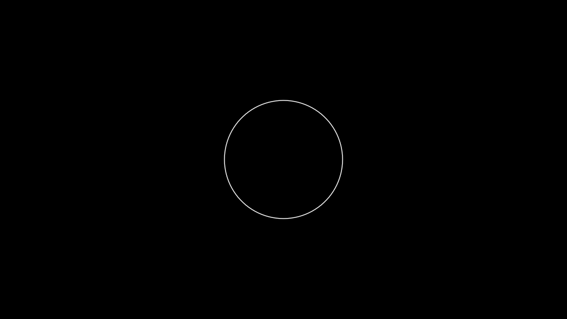
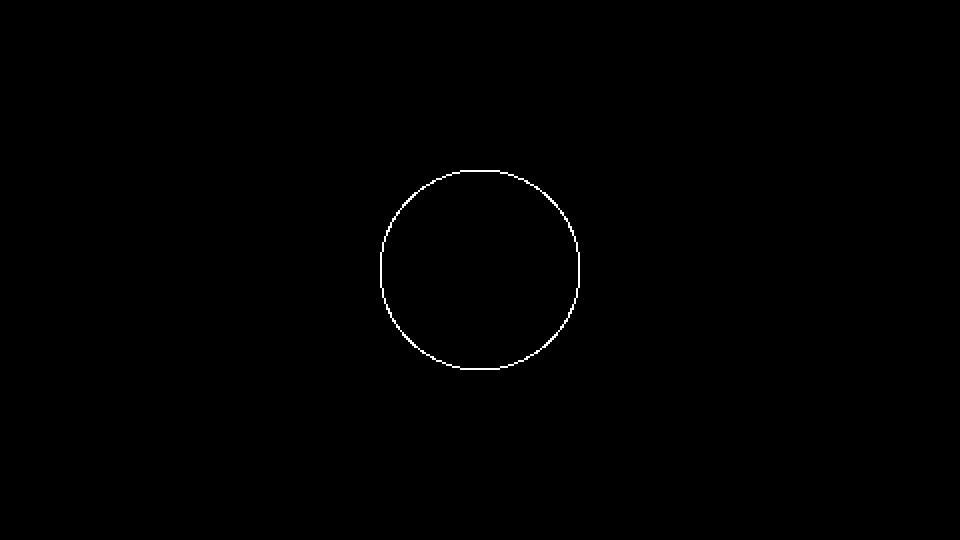
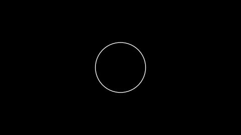
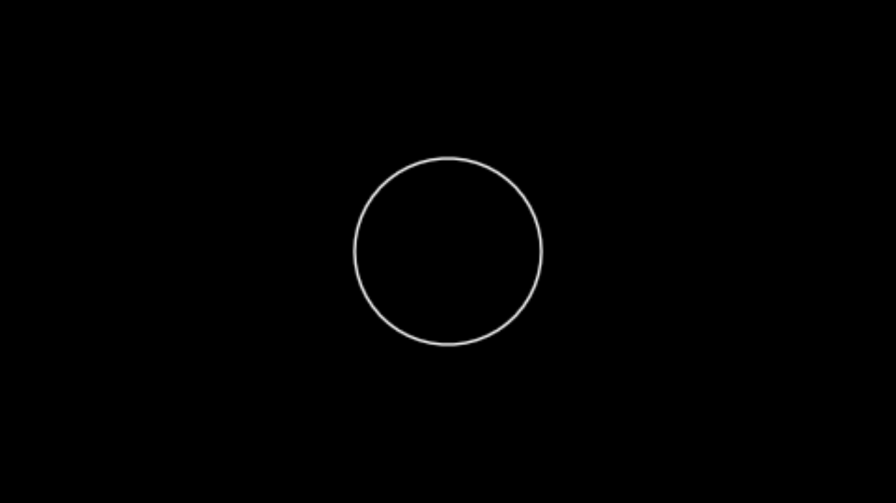
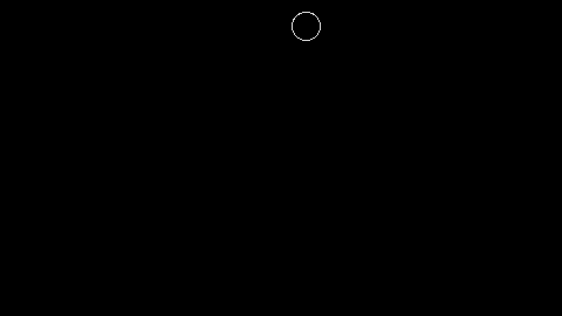
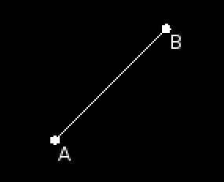
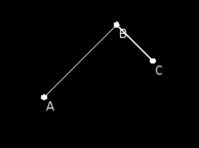

<!-- ---
title: "05 Game Basics"
date: 2018-02-12
author: https://github.com/a327ex
source: https://github.com/a327ex/blog/issues/19
--- -->

# Game Basics

## Introduction

In this part we'll start going over the game itself. First we'll go over an overview of how the game is structured in terms of gameplay, then we'll focus on a few basics that are common to all parts of the game, like its pixelated look, the camera, as well as the physics simulation. After that we'll go over basic player movement and lastly we'll take a look at garbage collection and how we should look out for possible object leaks.

## Gameplay Structure

The game itself is divided in only 3 different Rooms: `Stage`, `Console` and `SkillTree`.

The Stage room is where all the actual gameplay will take place and it will have objects such as the player, enemies, projectiles, resources, powerups and so on. The gameplay is very similar to that of [Bit Blaster XL](http://store.steampowered.com/app/433950/) and is actually quite simple. I chose something this simple because it would allow me to focus on the other aspect of the game (the huge skill tree) more thoroughly than if the gameplay was more complicated.


The Console room is where all the "menu" kind of stuff happens: changing sound and video settings, seeing achievements, choosing which ship you want to play with, accessing the skill tree, and so on. Instead of creating various different menus it makes more sense for a game that has this sort of computery look to it (also known as lazy programmer art xD) to go for this, since the console emulates a terminal and the idea is that you (the player) are just playing the game through some terminal somewhere.


The SkillTree room is where all the passive skills can be acquired. In the Stage room you can get SP (skill points) that spawn randomly or after you kill enemies, and then once you die you can use those skill points to buy passive skills. The idea is to try something massive like [Path of Exile's Passive Skill Tree](https://www.pathofexile.com/passive-skill-tree) and I think I was mildly successful at that. The skill tree I built has between 600-800 nodes and I think that's good enough.


I'll go over the creation of each of those rooms in detail, including all skills in the skill tree. However, I highly encourage you to deviate from what I'm writing as much as possible. A lot of the decisions I'm making when it comes to gameplay are pretty much just my own preference, and you might prefer something different.

For instance, instead of a huge skill tree you could prefer a huge class system that allows tons of combinations like [Tree of Savior's](http://www.tosbase.com/game/classes/). So instead of building the passive skill tree like I am, you could follow along on the implementation of all passive skills, but then build your own class system that uses those passive skills instead of building a skill tree.

This is just one idea and there are many different areas in which you could deviate in a similar way. One of the reasons I'm writing these tutorials with exercises is to encourage people to engage with the material by themselves instead of just following along because I think that that way people learn better. So whenever you see an opportunity to do something differently I highly recommend trying to do it.

## Game Size

Now let's start with the Stage. The first thing we want (and this will be true for all rooms, not just the Stage) is for it to have a sort low resolution pixelated look to it. For instance, look at this circle:



And then look at this:



I want the second one. The reason for this is purely aesthetic and my own personal preference. There are a number of games that don't go for the pixelated look but still use simple shapes and colors to get a really nice look, like [this one](https://www.youtube.com/watch?v=4iLW0X69mfo). So it just depends on which style you prefer and how much you can polish it. But for this game I'll go with the pixelated look.

The way to achieve that is by defining a very small default resolution first, preferably something that scales up exactly to a target resolution of `1920x1080`. For this game I'll go with `480x270`, since that's the target `1920x1080` divided by 4. To set the game's size to be this by default we need to use the file [`conf.lua`](https://love2d.org/wiki/Config_Files), which as I explained in a previous article is a configuration file that defines a bunch of default settings about a LÖVE project, including the resolution that the window will start with.

On top of that, in that file I also define two global variables `gw` and `gh`, corresponding to width and height of the base resolution, and `sx` and `sy` ones, corresponding to the scale that should be applied to the base resolution. The `conf.lua` file should be placed in the same folder as the `main.lua` file and this is what it should look like:

```lua
gw = 480 
gh = 270 
sx = 1
sy = 1

function love.conf(t)
    t.identity = nil                   -- The name of the save directory (string)
    t.version = "0.10.2"                -- The LÖVE version this game was made for (string)
    t.console = false                  -- Attach a console (boolean, Windows only)
 
    t.window.title = "BYTEPATH" -- The window title (string)
    t.window.icon = nil                -- Filepath to an image to use as the window's icon (string)
    t.window.width = gw -- The window width (number)
    t.window.height = gh -- The window height (number)
    t.window.borderless = false        -- Remove all border visuals from the window (boolean)
    t.window.resizable = true          -- Let the window be user-resizable (boolean)
    t.window.minwidth = 1              -- Minimum window width if the window is resizable (number)
    t.window.minheight = 1             -- Minimum window height if the window is resizable (number)
    t.window.fullscreen = false        -- Enable fullscreen (boolean)
    t.window.fullscreentype = "exclusive" -- Standard fullscreen or desktop fullscreen mode (string)
    t.window.vsync = true              -- Enable vertical sync (boolean)
    t.window.fsaa = 0                  -- The number of samples to use with multi-sampled antialiasing (number)
    t.window.display = 1               -- Index of the monitor to show the window in (number)
    t.window.highdpi = false           -- Enable high-dpi mode for the window on a Retina display (boolean)
    t.window.srgb = false              -- Enable sRGB gamma correction when drawing to the screen (boolean)
    t.window.x = nil                   -- The x-coordinate of the window's position in the specified display (number)
    t.window.y = nil                   -- The y-coordinate of the window's position in the specified display (number)
 
    t.modules.audio = true -- Enable the audio module (boolean)
    t.modules.event = true             -- Enable the event module (boolean)
    t.modules.graphics = true          -- Enable the graphics module (boolean)
    t.modules.image = true             -- Enable the image module (boolean)
    t.modules.joystick = true -- Enable the joystick module (boolean)
    t.modules.keyboard = true          -- Enable the keyboard module (boolean)
    t.modules.math = true              -- Enable the math module (boolean)
    t.modules.mouse = true             -- Enable the mouse module (boolean)
    t.modules.physics = true -- Enable the physics module (boolean)
    t.modules.sound = true -- Enable the sound module (boolean)
    t.modules.system = true            -- Enable the system module (boolean)
    t.modules.timer = true             -- Enable the timer module (boolean), Disabling it will result 0 delta time in love.update
    t.modules.window = true            -- Enable the window module (boolean)
    t.modules.thread = true            -- Enable the thread module (boolean)
end
```

If you run the game now you should see a smaller window than you had before.

Now, to achieve the pixelated look when we scale the window up we need to do some extra work. If you were to draw a circle at the center of the screen (`gw/2, gh/2`) right now, like this:



And scale the screen up directly by calling [`love.window.setMode`](https://love2d.org/wiki/love.window.setMode) with width `3*gw` and height `3*gh`, for instance, you'd get something like this:


And as you can see, the circle didn't scale up with the screen and it just stayed a small circle. And it also didn't stay centered on the screen, because `gw/2` and `gh/2` isn't the center of the screen anymore when it's scaled up by 3. What we want is to be able to draw a small circle at the base resolution of `480x270`, but then when the screen is scaled up to fit a normal monitor, the circle is also scaled up proportionally (and in a pixelated manner) and its position also remains proportionally the same. The easiest way to do that is by using a [`Canvas`](https://love2d.org/wiki/Canvas), which also goes by the name of framebuffer or render target in other engines. First, we'll create a canvas with the base resolution in the constructor of the `Stage` class:

```lua
function Stage:new()
    self.area = Area(self)
    self.main_canvas = love.graphics.newCanvas(gw, gh)
end
```

This creates a canvas with size `480x270` that we can draw to:

```lua
function Stage:draw()
    love.graphics.setCanvas(self.main_canvas)
    love.graphics.clear()
        love.graphics.circle('line', gw/2, gh/2, 50)
        self.area:draw()
    love.graphics.setCanvas()
end
```

The way the canvas is being drawn to is simply following the example on the [Canvas](https://love2d.org/wiki/Canvas) page. According to the page, when we want to draw something to a canvas we need to call [`love.graphics.setCanvas`](https://love2d.org/wiki/love.graphics.setCanvas), which will redirect all drawing operations to the currently set canvas. Then, we call [`love.graphics.clear`](https://love2d.org/wiki/love.graphics.clear), which will clear the contents of this canvas on this frame, since it was also drawn to in the last frame and every frame we want to draw everything from scratch. Then after that we draw what we want to draw and use `setCanvas` again, but passing nothing this time, so that our target canvas is unset and drawing operations aren't redirected to it anymore.

If we stopped here then nothing would appear on the screen. This happens because everything we drew went to the canvas but we're not actually drawing the canvas itself. So now we need to draw that canvas itself to the screen, and that looks like this:

```lua
function Stage:draw()
    love.graphics.setCanvas(self.main_canvas)
    love.graphics.clear()
        love.graphics.circle('line', gw/2, gh/2, 50)
        self.area:draw()
    love.graphics.setCanvas()

    love.graphics.setColor(255, 255, 255, 255)
    love.graphics.setBlendMode('alpha', 'premultiplied')
    love.graphics.draw(self.main_canvas, 0, 0, 0, sx, sy)
    love.graphics.setBlendMode('alpha')
end
```

We simply use [`love.graphics.draw`](https://love2d.org/wiki/love.graphics.draw) to draw the canvas to the screen, and then we also wrap that with some [`love.graphics.setBlendMode`](https://love2d.org/wiki/love.graphics.setBlendMode) calls that according to the Canvas page on the LÖVE wiki are used to prevent improper blending. If you run this now you should see the circle being drawn.

Note that we used `sx` and `sy` to scale the Canvas up. Those variables are set to 1 right now, but if you change those variables to 3, for instance, this is what would happen:


You can't see anything! But this is the because the circle that was now in the middle of the `480x270` canvas, is now in the middle of a `1440x810` canvas. Since the screen itself is only `480x270`, you can't see the entire Canvas that is bigger than the screen. To fix this we can create a function named `resize` in `main.lua` that will change both `sx` and `sy` as well as the screen size itself whenever it's called:

```lua
function resize(s)
    love.window.setMode(s*gw, s*gh) 
    sx, sy = s, s
end
```

And so if we call `resize(3)` in `love.load`, this should happen:



And this is roughly what we wanted. There's only one problem though: the circle looks kinda blurry instead of being properly pixelated.

The reason for this is that whenever things are scaled up or down in LÖVE, they use a [FilterMode](https://love2d.org/wiki/FilterMode) and this filter mode is set to `'linear'` by default. Since we want the game to have a pixelated look we should change this to `'nearest'`. Calling [`love.graphics.setDefaultFilter`](https://love2d.org/wiki/love.graphics.setDefaultFilter) with the `'nearest'` argument at the start of `love.load` should fix the issue. Another thing to do is to set the [LineStyle](https://love2d.org/wiki/LineStyle) to `'rough'`. Because it's set to `'smooth'` by default, LÖVE primitives will be drawn with some aliasing to them, and this doesn't work for a pixelated look. If you do all that and run the code again, it should look like this:


And it looks crispy and pixelated like we wanted it to! Most importantly, now we can use one resolution to build the entire game around. If we want to spawn an object at the center of the screen then we can say that it's `x, y` position should be `gw/2, gh/2`, and no matter what the resolution that we need to serve, that object will always be at the center of the screen. This significantly simplifies the process and it means we only have to worry about how the game looks and how things are distributed around the screen once.

### Game Size Exercises

**65.** Take a look at [Steam's Hardware Survey](http://store.steampowered.com/hwsurvey/) in the primary resolution section. The most popular resolution, used by almost half the users on Steam is `1920x1080`. This game's base resolution neatly multiplies to that. But the second most popular resolution is `1366x768`. `480x270` does not multiply into that at all. What are some options available for dealing with odd resolutions once the game is fullscreened into the player's monitor?  
**66.** Pick a game you own that uses the same or a similar technique to what we're doing here (scaling a small base resolution up). Usually games that use pixel art will do that. What is that game's base resolution? How does the game deal with odd resolutions that don't fit neatly into its base resolution? Change the resolution of your desktop and run the game various times with different resolutions to see what changes and how it handles the variance.

## Camera

All three rooms will make use of a camera so it makes sense to go through it now. From the second article in this series we used a library named [hump](https://github.com/vrld/hump) for timers. This library also has a useful camera module that we'll also use. However, I use a slightly modified version of it that also has screen shake functionality. You can download the files [here](https://github.com/SSYGEN/ModifiedCamera). Place the `camera.lua` file directory of the hump library (and overwrite the already existing `camera.lua`) and then require the camera module in `main.lua`. And place the `Shake.lua` file in the `objects` folder.

(Additionally, you can also use [this library](https://github.com/SSYGEN/STALKER-X) I wrote which has all this functionality already. I wrote this library after I wrote the entire tutorial, so the tutorial will go on as if the library didn't exist. If you do choose to use this library then you can follow along on the tutorial but sort of translating things to use the functions in this library instead.)

One function you'll need after adding the camera is this:

```lua
function random(min, max)
    local min, max = min or 0, max or 1
    return (min > max and (love.math.random()*(min - max) + max)) or (love.math.random()*(max - min) + min)
end
```

This function will allow you to get a random number between any two numbers. It's necessary because the `Shake.lua` file uses it. After defining that function in `utils.lua` try something like this:

```lua
function love.load()
    ...
    camera = Camera()
    input:bind('f3', function() camera:shake(4, 60, 1) end)
    ...
end

function love.update(dt)
    ...
    camera:update(dt)
    ...
end
```

And then on the `Stage` class:

```lua
function Stage:draw()
    love.graphics.setCanvas(self.main_canvas)
    love.graphics.clear()
  camera:attach(0, 0, gw, gh)
        love.graphics.circle('line', gw/2, gh/2, 50)
        self.area:draw()
  camera:detach()
    love.graphics.setCanvas()

    love.graphics.setColor(255, 255, 255, 255)
    love.graphics.setBlendMode('alpha', 'premultiplied')
    love.graphics.draw(self.main_canvas, 0, 0, 0, sx, sy)
    love.graphics.setBlendMode('alpha')
end
```

And you'll see that the screen shakes like this when you press `f3`:

 

The shake function is based on the one described on [this article](http://jonny.morrill.me/blog/view/14) and it takes in an amplitude (in pixels), a frequency and a duration. The screen will shake with a decay, starting from the amplitude, for duration seconds with a certain frequency. Higher frequencies means that the screen will oscillate more violently between extremes (amplitude, -amplitude), while lower frequencies will do the contrary.

Another important thing to notice about the camera is that it's not anchored to a certain spot right now, and so when it shakes it will be thrown in all directions, making it be positioned elsewhere by the time the shaking ends, as you could see in the previous gif.

One way to fix this is to center it and this can be achieved with the [camera:lockPosition](http://hump.readthedocs.io/en/latest/camera.html#camera:lockPosition) function. In the modified version of the camera module I changed all camera movement functions to take in a `dt` argument first. And so that would look like this:

```lua
function Stage:update(dt)
    camera.smoother = Camera.smooth.damped(5)
    camera:lockPosition(dt, gw/2, gh/2)

    self.area:update(dt)
end
```

The camera smoother is set to `damped` with a value of `5`. This was reached through trial and error but basically it makes the camera focus on the target point in a smooth and nice way. And the reason I placed this code inside the Stage room is that right now we're working with the Stage room and that room happens to be the one where the camera will need to be centered in the middle and never really move (other than screen shakes). And so that results in this:


We will use a single global camera for the entire game since there's no real need to instantiate a separate camera for each room. The Stage room will not use the camera in any way other than screen shakes, so that's where I'll stop for now. Both the Console and SkillTree rooms will use the camera more extensively but we'll get to that when we get to it.

## Player Physics

Now we have everything needed to start with the actual game and we'll start with the Player object. Create a new file in the `objects` folder named `Player.lua` that looks like this:

```lua
Player = GameObject:extend()

function Player:new(area, x, y, opts)
    Player.super.new(self, area, x, y, opts)
end

function Player:update(dt)
    Player.super.update(self, dt)
end

function Player:draw()

end
```

This is the default way a new game object class in the game should be created. All of them will inherit from `GameObject` and will have the same structure to its constructor, update and draw functions. Now we can instantiate this Player object in the Stage room like this:

```lua
function Stage:new()
    ...
    self.area:addGameObject('Player', gw/2, gh/2)
end
```

To test that the instantiation worked and that the Player object is being updated and drawn by the `Area`, we can simply have it draw a circle in its position:

```lua
function Player:draw()
    love.graphics.circle('line', self.x, self.y, 25)
end
```

And that should give you a circle at the center of the screen. It's interesting to note that the `addGameObject` call returns the created object, so we could keep a reference to the player inside Stage's `self.player`, and then if we wanted we could trigger the Player object's death with a keybind:

```lua
function Stage:new()
    ...
    self.player = self.area:addGameObject('Player', gw/2, gh/2)
    input:bind('f3', function() self.player.dead = true end)
end
```

And if you press the `f3` key then the Player object should be killed, which means that the circle will stop being drawn. This happens as a result of how we set up our `Area` object code from the previous article. It's also important to note that if you decide to hold references returned by `addGameObject` like this, if you don't set the variable holding the reference to `nil` that object will never be collected. And so it's important to keep in mind to always `nil` references (in this case by saying `self.player = nil`) if you want an object to truly be removed from memory (on top of settings its `dead` attribute to true).

___

Now for the physics. The Player (as well as enemies, projectiles and various resources) will be a physics objects. I'll use LÖVE's box2d integration for this, but this is something that is genuinely not necessary for this game, since it benefits in no way from using a full physics engine like box2d. The reason I'm using it is because I'm used to it. But I highly recommend you to try either rolling you own collision routines (which for a game like this is very easy to do), or using a library that handles that for you.

What I'll use and what the tutorial will follow is a library called [windfield](https://github.com/SSYGEA/windfield) that I created which makes using box2d with LÖVE a lot easier than it would otherwise be. Other libraries that also handle collisions in LÖVE are [HardonCollider](https://vrld.github.io/HardonCollider/index.html) or [bump.lua](https://github.com/kikito/bump.lua).

I highly recommend for you to either do collisions on your own or use one of these two other libraries instead of the one the tutorial will follow. This is because this will make you exercise a bunch of abilities that you'll constantly have to exercise, like picking between various distinct solutions and seeing which one fits your needs and the way you think best, as well as coming up with your own solutions to problems that will likely arise instead of just following a tutorial.

To repeat this again, one of the main reasons why the tutorial has exercises is so that people actively engage with the material so that they actually learn, and this is another opportunity to do that. If you just follow the tutorial along and don't learn to confront things you don't know by yourself then you'll never truly learn. So I _seriously_ recommend deviating from the tutorial here and doing the physics/collision part of the game on your own.

In any case, you can download the `windfield` library and require it in the `main.lua` file. According to its documentation there are the two main concepts of a `World` and a `Collider`. The World is the physics world that the simulation happens in, and the Colliders are the physics objects that are being simulated inside that world. So our game will need to have a physics world like and the player will be a collider inside that world.

We'll create a world inside the `Area` class by adding an `addPhysicsWorld` call:

```lua
function Area:addPhysicsWorld()
    self.world = Physics.newWorld(0, 0, true)
end
```

This will set the area's `.world` attribute to contain the physics world. We also need to update that world (and optionally draw it for debugging purposes) if it exists:

```lua
function Area:update(dt)
    if self.world then self.world:update(dt) end

    for i = #self.game_objects, 1, -1 do
        ...
    end
end

function Area:draw()
    if self.world then self.world:draw() end
    for _, game_object in ipairs(self.game_objects) do game_object:draw() end
end
```

We update the physics world before updating all the game objects because we want to use up to date information for our game objects, and that will happen only after the physics simulation is done for this frame. If we were updating the game objects first then they would be using physics information from the last frame and this sort of breaks the frame boundary. It doesn't really change the way things work much as far as I can tell but it's conceptually more confusing.

The reason we add the world through the `addPhysicsWorld` call instead of just adding it directly to the Area constructor is because we don't want all Areas to have physics worlds. For instance, the Console room will also use an Area object to handle its entities, but it will not need a physics world attached to that Area. So making it optional through the call of one function makes sense. We can instantiate the physics world in Stage's Area like this:

```lua
function Stage:new()
    self.area = Area(self)
    self.area:addPhysicsWorld()
    ...
end

```

And so now that we have a world we can add the Player's collider to it:

```lua
function Player:new(area, x, y, opts)
    Player.super.new(self, area, x, y, opts)

    self.x, self.y = x, y
    self.w, self.h = 12, 12
    self.collider = self.area.world:newCircleCollider(self.x, self.y, self.w)
    self.collider:setObject(self)
end
```

Note how the player having a reference to the Area comes in handy here, because that way we can access the Area's World to add new colliders to it. This pattern (of accessing things inside the Area) repeats itself a lot, which is I made it so that all `GameObject` objects have this same constructor where they receive a reference to the `Area` object they belong to.

In any case, in the Player's constructor we defined its width and height to be 12 via the `w` and `h` attributes. Then we add a new [`CircleCollider`](https://github.com/SSYGEA/windfield#newcirclecolliderx-y-r) with the radius set to the width. It doesn't make much sense now to make the collider a circle while having width and height defined but it will in the future, because as we add different types of ships that the player can be, visually the ships will have different widths and heights, but physically the collider will always be a circle for fairness between different ships as well as predictability to how they feel.

After the collider is added we call the [`setObject`](https://github.com/SSYGEA/windfield#setobjectobject) function which binds the Player object to the Collider we just created. This is useful because when two Colliders collide, we can get information in terms of Colliders but not in terms of objects. So, for instance, if the Player collides with a Projectile we will have in our hands two colliders that represent the Player and the Projectile but we might not have the objects themselves. Using `setObject` (and `getObject`) allows us to set and then extract the object that a Collider belongs to.

Finally now we can draw the Player according to its size:

```lua
function Player:draw()
    love.graphics.circle('line', self.x, self.y, self.w)
end
```

If you run the game now you should see a small circle that is the Player:


### Player Physics Exercises

If you chose to do collisions yourself or decided to use one of the alternative libraries for collisions/physics then you don't need to do these exercises.

**67.** Change the physics world's y gravity to 512. What happens to the Player object?  
**68.** What does the third argument of the `.newWorld` call do and what happens if it's set to false? Are there advantages/disadvantages to setting it to true/false? What are those?

## Player Movement

The way movement for the Player works in this game is that there's a constant velocity that you move at and an angle that can be changed by holding left or right. To get that to work we need a few variables:

```lua
function Player:new(area, x, y, opts)
    Player.super.new(self, area, x, y, opts)

    ...

    self.r = -math.pi/2
    self.rv = 1.66*math.pi
    self.v = 0
    self.max_v = 100
    self.a = 100
end
```

Here I define `r` as the angle the player is moving towards. It starts as `-math.pi/2`, which is pointing up. In LÖVE angles work in a clockwise way, meaning `math.pi/2` is down and `-math.pi/2` is up (and 0 is right). Next, the `rv` variable represents the velocity of angle change when the user presses left or right. Then we have `v`, which represents the player's velocity, and then `max_v`, which represents the maximum velocity possible. The last attribute is `a`, which represents the player's acceleration. These were all arrived at by trial and error.

To update the player's position using all these variables we can do something like this:

```lua
function Player:update(dt)
    Player.super.update(self, dt)

    if input:down('left') then self.r = self.r - self.rv*dt end
    if input:down('right') then self.r = self.r + self.rv*dt end

    self.v = math.min(self.v + self.a*dt, self.max_v)
    self.collider:setLinearVelocity(self.v*math.cos(self.r), self.v*math.sin(self.r))
end
```

The first two lines define what happens when the user presses the left or right keys. It's important to note that according to the Input library we're using those bindings had to be defined beforehand, and I did so in `main.lua` (since we'll use a global Input object for everything):

```lua
function love.load()
    ...
    input:bind('left', 'left')
    input:bind('right', 'right')
    ...
end
```

And so whenever the user pressed left or right, the `r` attribute, which corresponds to the player's angle, will be changed by `1.66*math.pi` radians in the appropriate direction. One important thing to note here is that this value is being multiplied by `dt`, which essentially means that this value is operating on a per second basis. So the angle at which the angle change happens is `1.66*math.pi` radians per second. This is a result of how the game loop that we went over in the first article works.

After this, we set the `v` attribute. This one is a bit more involved, but if you've done this in other languages it should be familiar. The original calculation is `self.v = self.v + self.a*dt`, which is just increasing the velocity by the acceleration. In this case, we increase it by 100 per second. But we also defined the `max_v` attribute, which should cap the maximum velocity allowed. If we don't cap the maximum velocity allowed then `self.v = self.v + self.a*dt` will keep increasing `v` forever with no end and the Player will become Sonic. We don't want that! And so one way to prevent that from happening would be like this:

```lua
function Player:update(dt)
    ...

    self.v = self.v + self.a*dt
    if self.v >= self.max_v then
        self.v = self.max_v
    end

    ...
end
```

In this way, whenever `v` went over `max_v` it would be capped at that value instead of going over it. Another shorthand way of writing this is by using the [`math.min`](http://pgl.yoyo.org/luai/i/math.min) function, which returns the minimum value of all arguments that are passed to it. In this case we're passing in the result of `self.v + self.a*dt` and `self.max_v`, which means that if the result of the addition goes over `max_v`, `math.min` will return `max_v`, since its smaller than the addition. This is a very common and useful pattern in Lua (and in other languages as well).

Finally, we set the Collider's x and y velocity to the `v` attribute multiplied by the appropriate amount given the angle of the object using [`setLinearVelocity`](https://love2d.org/wiki/Body:setLinearVelocity). In general whenever you want to move something in a direction and you have an angle to work with, you want to use `cos` to move it along the x axis and `sin` to move it along the y axis. This is also a very common pattern in 2D gamedev in general. I'm going to assume that you learned why this makes sense in school (and if you haven't then look up basic trigonometry on Google).

The final change we can make is one to the `GameObject` class and it's a simple one. Because we're using a physics engine we essentially have two representations of some variables, like position and velocity. We have the player's position and velocity through `x, y` and `v` attributes, and we have the Collider's position and velocity through [`getPosition`](https://love2d.org/wiki/Body:getPosition) and [`getLinearVelocity`](https://love2d.org/wiki/Body:getLinearVelocity). It's a good idea to keep both of those representations synced, and one way to achieve that sort of automatically is by changing the parent class of all game objects:

```lua
function GameObject:update(dt)
    if self.timer then self.timer:update(dt) end
    if self.collider then self.x, self.y = self.collider:getPosition() end
end
```

And so here we simply that if the object has a `collider` attribute defined, then `x` and `y` will be set to the position of that collider. And so whenever the collider's position changes, the representation of that position in the object itself will also change accordingly.

If you run the program now you should see this:

 

And so you can see that the Player object moves around normally and changes its direction when left or right arrow keys are pressed. One detail that's important here is that what is being drawn is the Collider via the `world:draw()` call in the Area object. We don't really want to draw colliders only, so it makes sense to comment that line out and draw the Player object directly:

```lua
function Player:draw()
    love.graphics.circle('line', self.x, self.y, self.w)
end
```

One last useful thing we can do is visualize the direction that the player is heading towards. And this can be done by just drawing a line from the player's position that points in the direction he's heading:

```lua
function Player:draw()
    love.graphics.circle('line', self.x, self.y, self.w)
    love.graphics.line(self.x, self.y, self.x + 2*self.w*math.cos(self.r), self.y + 2*self.w*math.sin(self.r))
end
```

And that looks like this:

 

This again is basic trigonometry and uses the same idea as I explained a while ago. Generally whenever you want to get a position `B` that is `distance` units away from position `A` such that position `B` is positioned at a specific `angle` in relation to position `A`, the pattern is something like: `bx = ax + distance*math.cos(angle)` and `by = ay + distance*math.sin(angle)`. Doing this is a very very common occurence in 2D gamedev (in my experience at least) and so getting an instinctive handle on how this works is useful.

### Player Movement Exercises

**69.** Convert the following angles to degrees (in your head) and also say which quadrant they belong to (top-left, top-right, bottom-left or bottom-right). Notice that in LÖVE the angles are counted in a clockwise manner instead of an anti-clockwise one like you learned in school.

```lua
math.pi/2
math.pi/4
3*math.pi/4
-5*math.pi/6
0
11*math.pi/12
-math.pi/6
-math.pi/2 + math.pi/4
3*math.pi/4 + math.pi/3
math.pi
```

**70.** Does the acceleration attribute `a` need to exist? How could would the player's update function look like if it didn't exist? Are there any benefits to it being there at all?  
**71.** Get the `(x, y)` position of point `B` from position `A` if the angle to be used is `-math.pi/4`, and the distance is `100`.  
  
**72.** Get the `(x, y)` position of point `C` from position `B` if the angle to be used is `math.pi/4`, and the distance if `50`. The position `A` and `B` and the distance and angle between them are the same as the previous exercise.  
  
**73.** Based on the previous two exercises, what's the general pattern involved when you want to get from point `A` to some point `C` when you all have to use are multiple points in between that all can be reached at through angles and distances?  
**74.** The syncing of both representations of Player attributes and Collider attributes mentioned positions and velocities, but what about rotation? A collider has a rotation that can be accessed through [`getAngle`](https://love2d.org/wiki/Body:getAngle). Why not also sync that to the `r` attribute?

## Garbage Collection

Now that we've added the physics engine code and some movement code we can focus on something important that I've been ignoring until now, which is dealing with memory leaks. One of the things that can happen in any programming environment is that you'll leak memory and this can have all sorts of bad effects. In a managed language like Lua this can be an even more annoying problem to deal with because things are more hidden behind black boxes than if you had full control of memory yourself.

The way the garbage collector works is that when there are no more references pointing to an object it will eventually be collected. So if you have a table that is only being referenced to by variable `a`, once you say `a = nil`, the garbage collector will understand that the table that was being referenced isn't being referenced by anything and so that table will be removed from memory in a future garbage collection cycle. The problem happens when a single object is being referenced to multiple times and you forget to dereference it in all those locations.

For instance, when we create a new object with `addGameObject` what happens is that the object gets added to a `.game_objects` list. This counts as one reference pointing to that object. What we also do in that function, though, is return the object itself. So previously we did something like `self.player = self.area:addGameObject('Player', ...)`, which means that on top of holding a reference to the object in the list inside the Area object, we're also holding a reference to it in the `self.player` variable. Which means that when we say `self.player.dead` and the Player object gets removed from the game objects list in the Area object, it will still not be collected because `self.player` is still pointing to it. So in this instance, to truly remove the Player object from memory we have to both set `dead` to true and then say `self.player = nil`.

This is just one example of how it could happen but this is a problem that can happen everywhere, and you should be especially careful about it when using other people's libraries. For instance, the physics library I built has a `setObject` function in which you pass in the object so that the Collider holds a reference to it. If the object dies will it be removed from memory? No, because the Collider is still holding a reference to it. Same problem, just in a different setting. One way of solving this problem is being explicit about the destruction of objects by having a `destroy` function for them, which will take care of dereferencing things.

So, one thing we can add to all objects this:

```lua
function GameObject:destroy()
    self.timer:destroy()
    if self.collider then self.collider:destroy() end
    self.collider = nil
end
```

So now all objects have this default `destroy` function. This function calls the `destroy` functions of the EnhancedTimer object as well as the [Collider's one](https://github.com/SSYGEA/windfield#destroy-1). What these functions do is essentially dereference things that the user will probably want removed from memory. For instance, inside `Collider:destroy`, one of the things that happens is that `self:setObject(nil)` is called, since if we want to destroy this object we don't want the Collider holding a reference to it anymore.

And then we can also change our Area update function like this:

```lua
function Area:update(dt)
    if self.world then self.world:update(dt) end

    for i = #self.game_objects, 1, -1 do
        local game_object = self.game_objects[i]
        game_object:update(dt)
        if game_object.dead then 
            game_object:destroy()
            table.remove(self.game_objects, i) 
        end
    end
end
```

If an object's `dead` attribute is set to true, then on top of removing it from the game objects list, we also call its destroy function, which will get rid of most references to it. We can expand this concept further and realize that the physics world itself also has a [World:destroy](https://github.com/SSYGEA/windfield#destroy), and so we might want to use it when destroying an Area object:

```lua
function Area:destroy()
    for i = #self.game_objects, 1, -1 do
        local game_object = self.game_objects[i]
        game_object:destroy()
        table.remove(self.game_objects, i)
    end
    self.game_objects = {}

    if self.world then
        self.world:destroy()
        self.world = nil
    end
end
```

When destroying an Area we first destroy all objects in it and then we destroy the physics world if it exists. We can now change the Stage room to accomodate for this:

```lua
function Stage:destroy()
    self.area:destroy()
    self.area = nil
end
```

And then we can also change the `gotoRoom` function:

```lua
function gotoRoom(room_type, ...)
    if current_room and current_room.destroy then current_room:destroy() end
    current_room = _G[room_type](...)
end
```

We check to see if `current_room` is a variable that exists and if it contains a `destroy` attribute (basically we ask if its holding an actual room), and if it does then we call the destroy function. And then we proceed with changing to the target room.

It's important to also remember that now with the addition of the destroy function, all objects have to follow the following template:

```lua
NewGameObject = GameObject:extend()

function NewGameObject:new(area, x, y, opts)
    NewGameObject.super.new(self, area, x, y, opts)
end

function NewGameObject:update(dt)
    NewGameObject.super.update(self, dt)
end

function NewGameObject:draw()

end

function NewGameObject:destroy()
    NewGameObject.super.destroy(self)
end
```

Now, this is all well and good, but how do we test to see if we're actually removing things from memory or not? One blog post I like that answers that question is [this one](http://bitsquid.blogspot.com.br/2011/08/fixing-memory-issues-in-lua.html), and it offers a relatively simple solution to track leaks:

```lua
function count_all(f)
    local seen = {}
    local count_table
    count_table = function(t)
        if seen[t] then return end
            f(t)
    seen[t] = true
    for k,v in pairs(t) do
        if type(v) == "table" then
    count_table(v)
        elseif type(v) == "userdata" then
    f(v)
        end
end
    end
    count_table(_G)
end

function type_count()
    local counts = {}
    local enumerate = function (o)
        local t = type_name(o)
        counts[t] = (counts[t] or 0) + 1
    end
    count_all(enumerate)
    return counts
end

global_type_table = nil
function type_name(o)
    if global_type_table == nil then
        global_type_table = {}
            for k,v in pairs(_G) do
        global_type_table[v] = k
    end
global_type_table[0] = "table"
    end
    return global_type_table[getmetatable(o) or 0] or "Unknown"
end
```

I'm not going to over what this code does because its explained in the article, but add it to `main.lua` and then add this inside `love.load`:

```lua
function love.load()
    ...
    input:bind('f1', function()
        print("Before collection: " .. collectgarbage("count")/1024)
        collectgarbage()
        print("After collection: " .. collectgarbage("count")/1024)
        print("Object count: ")
        local counts = type_count()
        for k, v in pairs(counts) do print(k, v) end
        print("-------------------------------------")
    end)
    ...
end
```

And so what this does is that whenever you press `f1`, it will show you the amount of memory before a garbage collection cycle and the amount of memory after it, as well as showing you what object types are in memory. This is useful because now we can, for instance, create a new Stage full of objects, delete it, and then see if the memory remains the same (or acceptably the same hehexD) as it was before the Stage was created. If it remains the same then we aren't leaking memory, if it doesn't then it means we are and we need to track down the cause of it.


### Garbage Collection Exercises

**75.** Bind the `f2` key to create and activate a new Stage with a `gotoRoom` call.  
**76.** Bind the `f3` key to destroy the current room.  
**77.** Check the amount of memory used by pressing `f1` a few times. After that spam the `f2` and `f3` keys a few times to create and destroy new rooms. Now check the amount of memory used again by pressing `f1` a few times again. Is it the same as the amount of memory as it was first or is it more?  
**78.** Set the Stage room to spawn 100 Player objects instead of only 1 by doing something like this:  
```lua
function Stage:new()
    ...
    for i = 1, 100 do 
        self.area:addGameObject('Player', gw/2 + random(-4, 4), gh/2 + random(-4, 4))
    end
end
```

Also change the Player's update function so that Player objects don't move anymore (comment out the movement code). Now repeat the process of the previous exercise. Is the amount of memory used different? And do the overall results change?