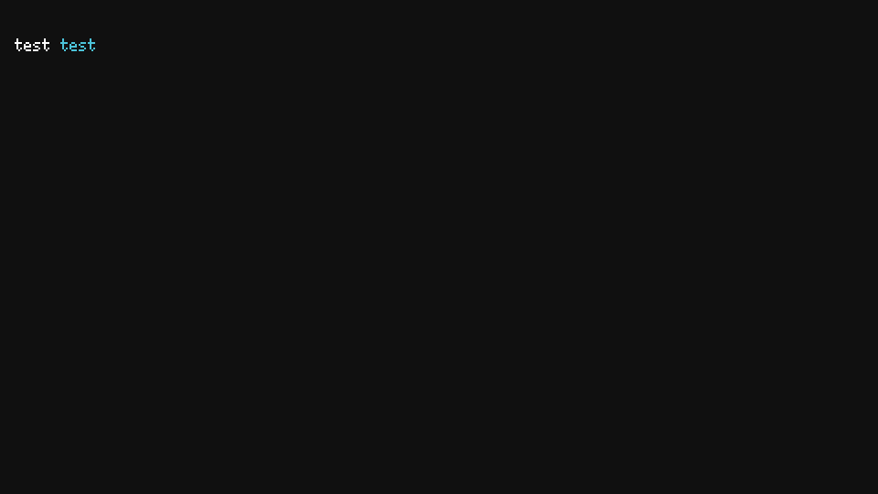
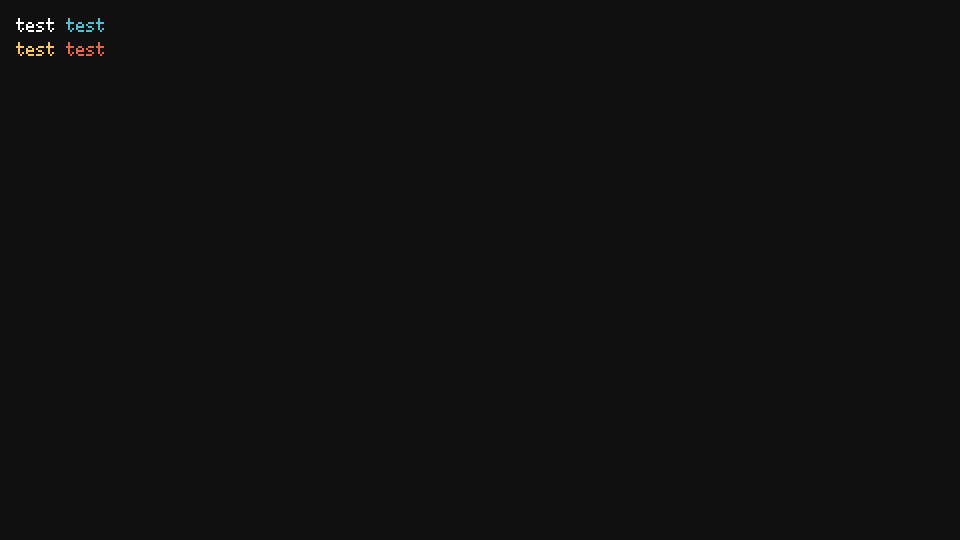
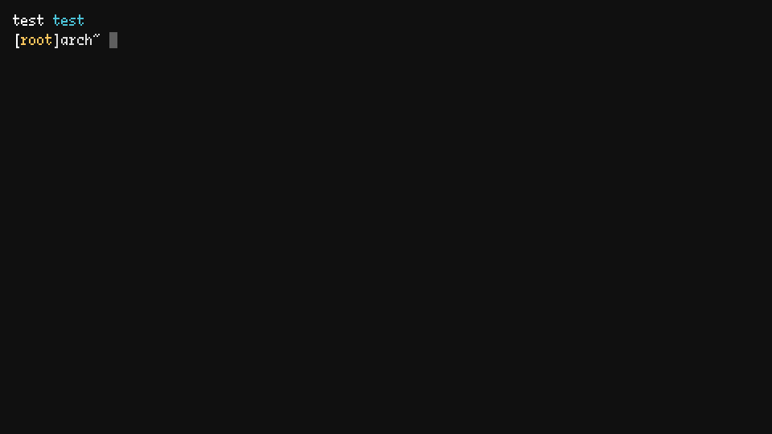

<!-- ---
title: "14 Console"
date: 2018-02-14
author: https://github.com/a327ex
source: https://github.com/a327ex/blog/issues/28
--- -->

# Console

## Introduction

In this article we'll go over the Console room. The Console is considerably easier to implement than everything else we've been doing so far because in the end it boils down to printing some text on the screen.

The Console room will be composed of 3 different types of objects: lines, input lines and modules. Lines are just normal colored text lines that appear on the screen. In the example above, for instance, ":: running BYTEPATH..." would be a line. As a data structure this will just be a table holding the position of the line as well as its text and colors.

Input lines are lines where the player can type things into. In the example above they are the ones that have "arch" in them. Typing certain commands in an input line will trigger those commands and usually they will either create more lines and modules. As a data structure this will be just like a line, except there's some additional logic needed to read input whenever the last line added to the room was an input one.

Finally, a module is a special object allows the user to do things that are a bit more complex than just typing commands. The whole set of things that appear when the player has to pick a ship, for instance, is one of those modules. A lot of commands will spawn these objects, so, for instance, if the player wants to change the volume of the game he will type "volume" and then the Volume module will appear and will let the player choose whatever level of sound he wants. These modules will all be objects of their own and the Console room will handle creating and deleting them when appropriate.

## Lines

So let's start with lines. The basic way in which we can define a line is like this:

```lua
{
    x = x, y = y, 
    text = love.graphics.newText(font, {boost_color, 'blue text', default_color, 'white text'}
}
```

So it has a `x, y` position as well as a `text` attribute. This text attribute is a [Text](https://love2d.org/wiki/Text) object. We'll use LÖVE's Text objects because they let us define colored text easily. But before we can add lines to our Console room we have to create it, so go ahead and do that. The basics of it should be the same as the SkillTree one.

We'll add a `lines` table to hold all the text lines, and then in the draw function we'll go over this table and draw each line. We'll also add a function named `addLine` which will add a new text line to the `lines` table:

```lua
function Console:new()
    ...
  
    self.lines = {}
    self.line_y = 8
    camera:lookAt(gw/2, gh/2)

    self:addLine(1, {'test', boost_color, ' test'})
end

function Console:draw()
    ...
    for _, line in ipairs(self.lines) do love.graphics.draw(line.text, line.x, line.y) end
    ...
end

function Console:addLine(delay, text)
    self.timer:after(delay, function() 
    table.insert(self.lines, {x = 8, y = self.line_y, 
        text = love.graphics.newText(self.font, text)}) 
      self.line_y = self.line_y + 12
    end)
end
```

There are a few additional things happening here. First there's the `line_y` attribute which will keep track of the y position where we should add a new line next. This is incremented by 12 every time we call `addLine`, since we want new lines to be added below the previous one, like it happens in a normal terminal.

Additionally the `addLine` function has a delay. This delay is useful because whenever we're adding multiple lines to the console, we don't want them to be added all the same time. We want a small delay between each addition because it makes everything feel better. One extra thing we could do here is make it so that on top of each line being added with a delay, its added character by character. So that instead of the whole line going in at once, each character is added with a small delay, which would give it an even nicer effect. I'm not doing this for the sake of time but it's a nice challenge (and we already have part of the logic for this in the InfoText object).

All that should look like this:



And if we add multiple lines it also looks like expected:



## Input Lines

Input lines are a bit more complicated but not by much. The first thing we wanna do is add an `addInputLine` function, which will act just like the `addLine` function, except it will add the default input line text and enable text input from the player. The default input line text we'll use is `[root]arch~` , which is just some flavor text to be placed before our input, like in a normal terminal.

```lua
function Console:addInputLine(delay)
    self.timer:after(delay, function()
        table.insert(self.lines, {x = 8, y = self.line_y, 
        text = love.graphics.newText(self.font, self.base_input_text)})
        self.line_y = self.line_y + 12
        self.inputting = true
    end)
end
```

And `base_input_text` looks like this:

```lua
function Console:new()
    ...
    self.base_input_text = {'[', skill_point_color, 'root', default_color, ']arch~ '}
    ...
end
```

We also set `inputting` to true whenever we add a new input line. This boolean will be used to tell us when we should be picking up input from the keyboard or not. If we are, then we'll simply add all characters that the player types to a list, put this list together as a string, and then add that string to our Text object. This looks like this:

```lua
function Console:textinput(t)
    if self.inputting then
        table.insert(self.input_text, t)
        self:updateText()
    end
end

function Console:updateText()
    local base_input_text = table.copy(self.base_input_text)
    local input_text = ''
    for _, character in ipairs(self.input_text) do input_text = input_text .. character end
    table.insert(base_input_text, input_text)
    self.lines[#self.lines].text:set(base_input_text)
end
```

And `Console:textinput` will get called whenever `love.textinput` gets called, which happens whenever the player presses a key:

```lua
-- in main.lua
function love.textinput(t)
    if current_room.textinput then current_room:textinput(t) end
end
```

One last thing we should do is making sure that the enter and backspace keys work. The enter key will turn `inputting` to false and also take the contents of the `input_text` table and do something with them. So if the player typed "help" and then pressed enter, we'll run the help command. And the backspace key should just remove the last element of the `input_text` table:

```lua
function Console:update(dt)
    ...
    if self.inputting then
        if input:pressed('return') then
            self.inputting = false
    -- Run command based on the contents of input_text here
            self.input_text = {}
        end
        if input:pressRepeat('backspace', 0.02, 0.2) then 
            table.remove(self.input_text, #self.input_text) 
            self:updateText()
        end
    end
end
```

Finally, we can also simulate a blinking cursor for some extra points. The basic way to do this is to just draw a blinking rectangle at the position after the width of `base_input_text` concatenated with the contents of `input_text`.

```lua
function Console:new()
    ...
    self.cursor_visible = true
    self.timer:every('cursor', 0.5, function() 
    self.cursor_visible = not self.cursor_visible 
    end)
end
```

In this way we get the blinking working, so we'll only draw the rectangle whenever `cursor_visible` is true. Next for the drawing the rectangle:

```lua
function Console:draw()
    ...
    if self.inputting and self.cursor_visible then
        local r, g, b = unpack(default_color)
        love.graphics.setColor(r, g, b, 96)
        local input_text = ''
        for _, character in ipairs(self.input_text) do input_text = input_text .. character end
        local x = 8 + self.font:getWidth('[root]arch~ ' .. input_text)
        love.graphics.rectangle('fill', x, self.lines[#self.lines].y,
      self.font:getWidth('w'), self.font:getHeight())
        love.graphics.setColor(r, g, b, 255)
    end
    ...
end
```

In here the variable `x` will hold the position of our cursor. We add 8 to it because every line is being drawn by default starting at position 8, so if we don't take this into account the cursor's position will be wrong. We also consider that the cursor rectangle's width is the width of the 'w' letter with the current font. Generally w is the widest letter to use so we'll go with that. But this could also be any other fixed number like 10 or 8 or whatever else.

And all that should look like this:



## Modules

Modules are objects that contain certain logic to let the player do something in the console. For instance, the `ResolutionModule` that we'll implement will let the player change the resolution of the game. We'll separate modules from the rest of the Console room code because they can get a bit too involved with their logic, so having them as separate objects is a good idea. We'll implement a module that looks like this:


This module in particular gets created and added whenever the player has pressed enter after typing "resolution" on an input line. Once it's activated it takes control away from the console and adds a few lines with `Console:addLine` to it. It then also has some selection logic on top of those added lines so we can pick our target resolution. Once the resolution is picked and the player presses enter, the window is changed to reflect that new resolution, we add a new input line with `Console:addInputLine` and disable selection on this ResolutionModule object, giving control back to the console.

All modules will work somewhat similarly to this. They get created/added, they do what they're supposed to do by taking control away from the Console room, and then when their behavior is done they give it control back. We can implement the basics of this on the Console object like this:

```lua
function Console:new()
    ...
    self.modules = {}
    ...
end

function Console:update(dt)
    self.timer:update(dt)
    for _, module in ipairs(self.modules) do module:update(dt) end

    if self.inputting then
    ...
end
  
function Console:draw()
    ...
    for _, module in ipairs(self.modules) do module:draw() end
    camera:detach()
    ...
end
```

Because we're mostly coding this by ourselves we can skip some formalities here. Even though I just said we'll have this sort of rule/interface between Console object and Module objects where they exchange control of the player's input with each other, in reality all we have to do is simply add modules to the `self.modules` table, update and draw them. Each module will take care of activating/deactivating itself whenever appropriate, which means that on the Console side of things we don't really have to do much.

Now for the creation of the ResolutionModule:

```lua
function Console:update(dt)
    ...
    if self.inputting then
        if input:pressed('return') then
            self.line_y = self.line_y + 12
            local input_text = ''
            for _, character in ipairs(self.input_text) do 
                input_text = input_text .. character 
          end
            self.input_text = {}

            if input_text == 'resolution' then
                table.insert(self.modules, ResolutionModule(self, self.line_y))
            end
        end
        ...
    end
end
```

In here we make it so that the `input_text` variable will hold what the player typed into the input line, and then if this text is equal to "resolution" we create a new ResolutionModule object and add it to the `modules` list. Most modules will need a reference to the console as well as the current y position where lines are added to, since the module will be placed below the lines that exist currently in the console. So to achieve that we pass both `self` and `self.line_y` when we create a new module object.

The ResolutionModule itself is rather straightforward. For this one in particular all we'll have to do is add a bunch of lines as well as some small amount of logic to select between each line. To add the lines we can simply do this:

```lua
function ResolutionModule:new(console, y)
    self.console = console
    self.y = y

    self.console:addLine(0.02, 'Available resolutions: ')
    self.console:addLine(0.04, '    480x270')
    self.console:addLine(0.06, '    960x540')
    self.console:addLine(0.08, '    1440x810')
    self.console:addLine(0.10, '    1920x1080')
end
```

To make things easy for now all the resolutions we'll concern ourselves with are the ones that are multiples of the base resolution, so all we have to do is add those 4 lines.

After this is done all we have to do is add the selection logic. The selection logic feels like a hack but it works well: we'll just place a rectangle on top of the current selection and move this rectangle around as the player presses up or down. We'll need a variable to keep track of which number we're in now (1 through 4), and then we'll draw this rectangle at the appropriate y position based on this variable. All this looks like this:

```lua
function ResolutionModule:new(console, y)
    ...
    self.selection_index = sx
    self.selection_widths = {
        self.console.font:getWidth('480x270'), self.console.font:getWidth('960x540'),
        self.console.font:getWidth('1440x810'), self.console.font:getWidth('1920x1080')
    }
end
```

The `selection_index` variable will keep track of our current selection and we start it at `sx`. `sx` is either 1, 2, 3 or 4 based on the size we chose in `main.lua` when we called the `resize` function. `selection_widths` holds the widths for the rectangle on each selection. Since the rectangle will end up covering each resolution, we need to figure out its size based on the size of the characters that make up the string for that resolution.

```lua
function ResolutionModule:update(dt)
    ...
    if input:pressed('up') then
        self.selection_index = self.selection_index - 1
        if self.selection_index < 1 then self.selection_index = #self.selection_widths end
    end

    if input:pressed('down') then
        self.selection_index = self.selection_index + 1
        if self.selection_index > #self.selection_widths then self.selection_index = 1 end
    end
    ...
end
```

In the update function we'll handle the logic for when the player presses up or down. We just need to increase or decrease `selection_index` and take care to not go below 1 or above 4.

```lua
function ResolutionModule:draw()
    ...
    local width = self.selection_widths[self.selection_index]
    local r, g, b = unpack(default_color)
    love.graphics.setColor(r, g, b, 96)
    local x_offset = self.console.font:getWidth('    ')
    love.graphics.rectangle('fill', 8 + x_offset - 2, self.y + self.selection_index*12, 
    width + 4, self.console.font:getHeight())
    love.graphics.setColor(r, g, b, 255)
end
```

And in the draw function we just draw the rectangle at the appropriate position. Again, this looks terrible and full of weird numbers all over but we need to place the rectangle in the appropriate location, and there's no "clean" way of doing it.

The only thing left to do now is to make sure that this object is only reading input whenever it's active, and that it's active only right after it has been created and before the player has pressed enter to select a resolution. After the player presses enter it should be inactive and not reading input anymore. A simple way to do this is like this:

```lua
function ResolutionModule:new(console, y)
    ...
    self.console.timer:after(0.02 + self.selection_index*0.02, function() 
        self.active = true 
    end)
end

function ResolutionModule:update(dt)
    if not self.active then return end
...
  if input:pressed('return') then
    self.active = false
    resize(self.selection_index)
    self.console:addLine(0.02, '')
    self.console:addInputLine(0.04)
   end
end

function ResolutionModule:draw()
    if not self.active then return end
    ...
end
```

The `active` variable will be set to true a few frames after the module is created. This is to avoid having the rectangle drawn before the lines are added, since the lines are added with a small delay between each other. If this `active` variable is not active then the update nor the draw function won't run, which means we won't be reading input for this object nor drawing the selection rectangle. Additionally, whenever we press enter we set `active` to false, call the `resize` function and then give control back to the Console by adding a new input line. All this gives us the appropriate behavior and everything should work as expected now.

### Exercises

**227\. (CONTENT)** Make it so that whenever there are more lines than the screen can cover in the Console room, the camera scrolls down as lines and modules are added.  
**228\. (CONTENT)** Implement the `AchievementsModule` module. This displays all achievements and what's needed to unlock them. Achievements will be covered in the next article, so you can come back to this exercise later!  
**229\. (CONTENT)** Implement the `ClearModule` module. This module allows for clearing of all saved data or the clearing of the skill tree. Saving/loading data will be covered in the next article as well, so you can come back to this exercise later too.  
**230\. (CONTENT)** Implement the `ChooseShipModule` module. This modules allows the player to choose and unlocks ships with which to play the game. This is what it looks like:  
**231\. (CONTENT)** Implement the `HelpModule` module. This displays all available commands and lets the player choose a command without having to type anything. The game also has to support gamepad only players so forcing the player to type things is not good.  
**232\. (CONTENT)** Implement the `VolumeModule` module. This lets the player change the volume of sound effects and music.  
**233\. (CONTENT)** Implement the `mute`, `skills`, `start` ,`exit` and `device` commands. `mute` mutes all sound. `skills` changes to the SkillTree room. `start` spawns a ChooseShipModule and then starts the game after the player chooses a ship. `exit` exits the game.

## END

And this is it for the console. With only these three ideas (lines, input lines and modules) we can do a lot and use this to add a lot of flavor to the game. The next article is the last one and in it we'll cover a bunch of random things that didn't fit in any other articles before.